# LibroSys — Modelo Entidad-Relación (DER)

**Versión:** 2.0 — Julio 2026  
**Fuente:** Análisis de 70+ pantallas, `Frontend/src/types/domain.ts`, mocks, servicios ERP y scripts MySQL existentes.  
**Prioridad:** Comportamiento real del sistema sobre suposiciones.

---

## 1. Diagrama Entidad-Relación por módulos

```mermaid
flowchart TB
  subgraph SEG["🔐 SEGURIDAD"]
    roles((roles))
    permisos((permisos))
    rol_permiso{{rol_permiso}}
    usuarios((usuarios))
    sesion_usuario((sesion_usuario))
    mfa_usuario((mfa_usuario))
    roles --- rol_permiso
    permisos --- rol_permiso
    roles --> usuarios
    usuarios --> sesion_usuario
    usuarios --> mfa_usuario
  end

  subgraph ADM["🏢 ADMINISTRACIÓN"]
    categorias((categorias))
    editoriales((editoriales))
    proveedores((proveedores))
    sucursales((sucursales))
    almacenes((almacenes))
    monedas((monedas))
    tasas_cambio((tasas_cambio))
    historial_tasa_cambio((historial_tasa_cambio))
    contrato_editorial((contrato_editorial))
    renovacion_contrato((renovacion_contrato))
    condicion_comercial((condicion_comercial))
    sucursales --> almacenes
    monedas --> tasas_cambio
    tasas_cambio --> historial_tasa_cambio
    editoriales --> contrato_editorial
    contrato_editorial --> renovacion_contrato
    editoriales --> condicion_comercial
  end

  subgraph INV["📦 INVENTARIO"]
    productos((productos))
    inventario((inventario))
    movimiento_inventario((movimiento_inventario))
    ajuste_inventario((ajuste_inventario))
    conteo_fisico((conteo_fisico))
    detalle_conteo_fisico((detalle_conteo_fisico))
    categorias --> productos
    editoriales --> productos
    productos --> inventario
    almacenes --> inventario
    productos --> movimiento_inventario
    almacenes --> movimiento_inventario
    productos --> ajuste_inventario
    almacenes --> conteo_fisico
    conteo_fisico --> detalle_conteo_fisico
  end

  subgraph COM["🛒 COMPRAS"]
    orden_compra((orden_compra))
    detalle_orden_compra((detalle_orden_compra))
    factura_proveedor((factura_proveedor))
    recepcion((recepcion))
    detalle_recepcion((detalle_recepcion))
    proveedores --> orden_compra
    monedas --> orden_compra
    usuarios --> orden_compra
    orden_compra --> detalle_orden_compra
    productos --> detalle_orden_compra
    orden_compra --> factura_proveedor
    orden_compra --> recepcion
    recepcion --> detalle_recepcion
  end

  subgraph IMP["🚢 IMPORTACIONES"]
    factura_internacional((factura_internacional))
    embarque((embarque))
    consolidacion((consolidacion))
    consolidacion_embarque{{consolidacion_embarque}}
    costos_embarque((costos_embarque))
    costeo_libro((costeo_libro))
    pallet((pallet))
    caja_imp((caja))
    orden_compra --> factura_internacional
    factura_internacional --> embarque
    embarque --> costos_embarque
    embarque --> costeo_libro
    consolidacion --- consolidacion_embarque
    embarque --- consolidacion_embarque
    embarque --> pallet
    pallet --> caja_imp
  end

  subgraph VEN["💰 VENTAS"]
    venta((venta))
    detalle_venta((detalle_venta))
    nota_credito((nota_credito))
    cambio_producto((cambio_producto))
    venta --> detalle_venta
    productos --> detalle_venta
    venta --> nota_credito
    venta --> cambio_producto
  end

  subgraph TRF["🔄 TRANSFERENCIAS"]
    transferencia((transferencia))
    detalle_transferencia((detalle_transferencia))
    almacenes --> transferencia
    transferencia --> detalle_transferencia
  end

  subgraph EVT["🎪 EVENTOS Y FERIAS"]
    eventos((eventos))
    empleado((empleado))
    asignacion_personal_evento((asignacion_personal_evento))
    presupuestos_evento((presupuestos_evento))
    evento_gasto((evento_gasto))
    evento_producto_planificado((evento_producto_planificado))
    evento_utensilio((evento_utensilio))
    evento_editorial((evento_editorial))
    evento_historial((evento_historial))
    caja_evento((caja_evento))
    factura_evento((factura_evento))
    eventos --> asignacion_personal_evento
    empleado --> asignacion_personal_evento
    eventos --> presupuestos_evento
    eventos --> evento_gasto
    eventos --> evento_producto_planificado
    eventos --> evento_utensilio
    eventos --> evento_editorial
    eventos --> evento_historial
    eventos --> caja_evento
    caja_evento --> factura_evento
  end

  subgraph CFG["⚙️ CONFIGURACIÓN"]
    configuracion((configuracion))
    notificaciones((notificaciones))
    correo_notificacion((correo_notificacion))
    notificaciones --> correo_notificacion
  end

  subgraph AUD["📋 AUDITORÍA"]
    auditoria((auditoria))
    auditoria_cambio((auditoria_cambio))
    auditoria_acceso((auditoria_acceso))
    auditoria_eliminacion((auditoria_eliminacion))
    auditoria --> auditoria_cambio
    auditoria --> auditoria_acceso
    auditoria --> auditoria_eliminacion
  end

  %% Cross-module links
  venta --> movimiento_inventario
  recepcion --> movimiento_inventario
  detalle_venta --> productos
  venta --> eventos
  venta --> caja_evento
  factura_evento --> venta
  embarque --> recepcion
  usuarios --> venta
  usuarios --> movimiento_inventario
  usuarios --> auditoria
```



---

## 2. Inventario de pantallas → tablas

| Módulo | Pantallas analizadas | Tablas que alimentan |
|--------|---------------------|----------------------|
| Dashboard | KPIs, stock crítico, actividad | `productos`, `inventario`, `venta`, `orden_compra`, `embarque`, `eventos`, `notificaciones` |
| Inventario | General, Kardex, Ubicaciones, Ajustes, Conteos | `productos`, `inventario`, `movimiento_inventario`, `ajuste_inventario`, `conteo_fisico` |
| Ventas | Dashboard, POS, Historial, Cambios/NC | `venta`, `detalle_venta`, `nota_credito`, `cambio_producto` |
| Compras | Dashboard, OC, Recepciones, Facturas | `orden_compra`, `detalle_orden_compra`, `recepcion`, `factura_proveedor` |
| Importaciones | 7 pestañas + registrar embarque | `factura_internacional`, `embarque`, `consolidacion`, `costos_embarque`, `costeo_libro`, `pallet`, `caja` |
| Transferencias | Solicitud + historial | `transferencia`, `detalle_transferencia` |
| Editoriales | 6 sub-pantallas | `editoriales`, `contrato_editorial`, `renovacion_contrato`, `condicion_comercial`, `productos` |
| Eventos | Calendario + 6 tabs + formulario extendido | `eventos`, `empleado`, `asignacion_personal_evento`, `presupuestos_evento`, `evento_*`, `caja_evento`, `factura_evento` |
| Reportes | 6 reportes | Vistas sobre tablas operativas |
| Usuarios | Roles, permisos, sesiones, MFA | `roles`, `permisos`, `usuarios`, `sesion_usuario`, `mfa_usuario` |
| Auditoría | 4 pestañas | `auditoria`, `auditoria_cambio`, `auditoria_acceso`, `auditoria_eliminacion` |
| Configuración | General, notificaciones, correos | `configuracion`, `notificaciones`, `correo_notificacion` |
| Administración | Catálogos maestros | `productos`, `categorias`, `editoriales`, `sucursales`, `proveedores`, `monedas`, `tasas_cambio` |

---

## 3. Catálogo de tablas

### 🔐 SEGURIDAD

| Tabla | Por qué existe | Depende de | La llena | La usa |
|-------|----------------|------------|----------|--------|
| `roles` | Pantalla Usuarios → pestaña Roles | — | Admin | Auth, permisos |
| `permisos` | Matriz Ver/Crear/Editar/Eliminar por módulo | — | Admin | `rol_permiso` |
| `rol_permiso` | N:M rol ↔ permiso | roles, permisos | Admin | Auth |
| `usuarios` | CRUD usuarios, cajeros, responsables | roles | Admin | Todos los módulos transaccionales |
| `sesion_usuario` | Pestaña Sesiones activas | usuarios | Sistema login | Usuarios |
| `mfa_usuario` | Pestaña MFA | usuarios | Usuario/Admin | Usuarios |

### 🏢 ADMINISTRACIÓN

| Tabla | Por qué existe | Depende de | La llena | La usa |
|-------|----------------|------------|----------|--------|
| `categorias` | Admin + filtros inventario | — | Admin | productos |
| `editoriales` | Admin + módulo Editoriales | — | Admin | productos, eventos, contratos |
| `proveedores` | OC, facturas, embarques | — | Admin | compras, importaciones |
| `sucursales` | Sucursales, ventas, eventos | — | Admin | almacenes, venta |
| `almacenes` | Stock por ubicación (central/sucursal/evento/transito) | sucursales | Admin | inventario, venta, transferencias, caja_evento |
| `monedas` | OC, facturas, ventas | — | Admin | tasas, transacciones |
| `tasas_cambio` | Admin tasas de cambio | monedas | Admin | importaciones, compras int. |
| `historial_tasa_cambio` | Historial en AdminExchangeRates | tasas_cambio | Trigger/admin | Reportes |
| `contrato_editorial` | Editoriales → Contratos | editoriales | Comercial | Editoriales, reportes |
| `renovacion_contrato` | Editoriales → Renovaciones | contrato_editorial | Comercial | Editoriales |
| `condicion_comercial` | Editoriales → Condiciones | editoriales | Comercial | Compras |

### 📦 INVENTARIO

| Tabla | Por qué existe | Depende de | La llena | La usa |
|-------|----------------|------------|----------|--------|
| `productos` | Catálogo único (Admin + Inventario + POS) | categorias, editoriales | Admin/Inventario | venta, OC, kardex |
| `inventario` | Stock por almacén (tab Ubicaciones + General) | productos, almacenes | Recepciones, ventas, ajustes | POS, eventos, transferencias |
| `movimiento_inventario` | Kardex (tab + reporte) | productos, almacenes, usuarios | Triggers/servicios | Inventario, auditoría |
| `ajuste_inventario` | Tab Ajustes | productos, almacenes | Inventario | Kardex |
| `conteo_fisico` | Tab Conteos | almacenes | Inventario | Inventario |
| `detalle_conteo_fisico` | Líneas de conteo | conteo_fisico, productos | Inventario | Inventario |

### 🛒 COMPRAS

| Tabla | Por qué existe | Depende de | La llena | La usa |
|-------|----------------|------------|----------|--------|
| `orden_compra` | OrdenesCompraPage (ERP) | proveedores, monedas | Compras | recepcion, factura, importaciones |
| `detalle_orden_compra` | Líneas de OC | orden_compra, productos | Compras | recepcion, costeo_libro |
| `factura_proveedor` | FacturasProveedoresPage | orden_compra, proveedor | Compras | Reportes |
| `recepcion` | RecepcionesPage | orden_compra | Compras/Importaciones | inventario |
| `detalle_recepcion` | Ítems recibidos | recepcion, productos | Compras | inventario (trigger) |

### 🚢 IMPORTACIONES

| Tabla | Por qué existe | Depende de | La llena | La usa |
|-------|----------------|------------|----------|--------|
| `factura_internacional` | FacturasInternacionalesPage | orden_compra | Compras (aprobación OC int.) | embarque |
| `embarque` | EmbarquesPage | factura_internacional | importService | costos, costeo, pallet |
| `consolidacion` | ConsolidacionesPage | — | importService (auto en aduana) | embarques |
| `consolidacion_embarque` | N:M consolidación ↔ embarque | consolidacion, embarque | importService | Consolidaciones |
| `costos_embarque` | CostosFletePage (1:1 embarque) | embarque | RegistrarEmbarquePage | costeo_libro |
| `costeo_libro` | CosteoLibroPage | embarque, productos, OC | importService (estado costeado) | Inventario costo |
| `pallet` | PalletsCajasPage | embarque | Logística | caja |
| `caja` | PalletsCajasPage (bulto importación) | pallet, embarque | Logística | — |

### 💰 VENTAS

| Tabla | Por qué existe | Depende de | La llena | La usa |
|-------|----------------|------------|----------|--------|
| `venta` | POS + Historial + **eventos** | sucursal, almacén, usuario, moneda, evento?, caja? | POS, Facturación evento | inventario, reportes |
| `detalle_venta` | Líneas de venta | venta, productos | POS, Facturación | inventario |
| `nota_credito` | CambiosNotasCreditoPage | venta | Ventas | Reportes |
| `cambio_producto` | CambiosNotasCreditoPage | venta, productos | Ventas | nota_credito, inventario |

**Campos clave en `venta` (ampliación):**
- `tipo_venta`: `normal` | `evento` | `feria`
- `evento_id`: FK nullable (obligatorio si tipo ≠ normal)
- `caja_evento_id`: FK nullable (obligatorio en ventas de evento)
- `metodo_pago`, `tipo_cliente`: campos del POS mock

### 🎪 EVENTOS Y FERIAS (flujo ampliado)

| Tabla | Por qué existe | Depende de | La llena | La usa |
|-------|----------------|------------|----------|--------|
| `eventos` | Events.tsx calendario + ERP | editoriales, usuarios, almacenes | eventService | Todo el módulo |
| `empleado` | StaffAssignmentContext (Employee) | — | RRHH | asignacion_personal_evento |
| `asignacion_personal_evento` | Tab Asignaciones + form Personal | eventos, empleado | StaffAssignmentContext | Eventos |
| `presupuestos_evento` | Tab Presupuestos (detalle por concepto) | eventos, monedas | Coordinador evento | Dashboard evento |
| `evento_gasto` | Tab Costos | eventos | Coordinador | Presupuesto (gastos) |
| `evento_producto_planificado` | Form Inventario (planificación, NO stock) | eventos, productos | EventFormDialog | Logística evento |
| `evento_utensilio` | Form Utensilios | eventos | EventFormDialog | Presupuesto (gastos) |
| `evento_editorial` | Tab Editoriales (stand, productos) | eventos, editoriales | Coordinador | Eventos |
| `evento_historial` | Tab Historial detalle | eventos, usuarios | Sistema | Auditoría evento |
| `caja_evento` | **Nueva Facturación** — apertura/cierre | eventos, almacenes, usuarios | Cajero evento | factura_evento |
| `factura_evento` | Factura emitida en evento (1:1 venta) | eventos, caja_evento, venta | Facturación evento | ingresos, presupuesto |

**Presupuesto en `eventos` (resumen calculado):**
- `presupuesto_asignado`, `total_ingresos`, `total_gastos`, `presupuesto_disponible` (GENERATED), `estado_presupuesto`

### 🔄 TRANSFERENCIAS

| Tabla | Por qué existe | Depende de | La llena | La usa |
|-------|----------------|------------|----------|--------|
| `transferencia` | Transfers.tsx | almacenes, usuarios | transferService | inventario |
| `detalle_transferencia` | Productos transferidos | transferencia, productos | transferService | inventario |

### ⚙️ CONFIGURACIÓN

| Tabla | Por qué existe | Depende de | La llena | La usa |
|-------|----------------|------------|----------|--------|
| `configuracion` | ConfiguracionGeneralPage | — | Admin | Sistema |
| `notificaciones` | NotificacionesPage + ERP | usuarios | Sistema | UI |
| `correo_notificacion` | CorreosPage | notificaciones | Sistema | Email |

### 📋 AUDITORÍA

| Tabla | Por qué existe | Depende de | La llena | La usa |
|-------|----------------|------------|----------|--------|
| `auditoria` | Registro principal | usuarios | Triggers/servicios | Auditoría |
| `auditoria_cambio` | Tab Cambios | auditoria | Triggers | Auditoría |
| `auditoria_acceso` | Tab Accesos + Usuarios historial | auditoria, usuarios | Login | Auditoría |
| `auditoria_eliminacion` | Tab Eliminaciones | auditoria | Triggers | Auditoría |

---

## 4. Flujo Eventos y Ferias (modelo actualizado)

```
eventos (crear)
  → presupuestos_evento + eventos.presupuesto_asignado
  → asignacion_personal_evento (empleado)
  → evento_producto_planificado + evento_utensilio (planificación)
  → estado: en_curso
  → caja_evento (apertura, monto_inicial, almacen_id)
  → factura_evento + venta (tipo_venta=evento|feria)
       → detalle_venta
       → movimiento_inventario (mismo motor)
  → eventos.total_ingresos ↑ (trigger)
  → eventos.total_gastos ↑ (evento_gasto + utensilios)
  → caja_evento (cierre)
  → eventos.estado: finalizado
```

---

## 5. Mapa de relaciones del sistema

### Compras
```
proveedor → orden_compra → detalle_orden_compra → producto
orden_compra → factura_proveedor
orden_compra → recepcion → detalle_recepcion → movimiento_inventario (entrada)
```

### Importaciones
```
orden_compra (internacional) → factura_internacional → embarque
embarque → costos_embarque
embarque → consolidacion (vía consolidacion_embarque)
embarque → costeo_libro ← detalle_orden_compra + costos_embarque
embarque → pallet → caja
embarque (finalizado) → recepcion → inventario
```

### Ventas normales
```
venta (tipo=normal) → detalle_venta → producto
venta → movimiento_inventario (salida)
venta → cambio_producto → nota_credito
```

### Ventas de evento
```
evento → caja_evento (abierta) → factura_evento → venta (tipo=evento|feria)
venta → detalle_venta → inventario (mismo almacén de caja)
factura_evento → actualiza eventos.total_ingresos
```

### Transferencias
```
transferencia → detalle_transferencia
almacén_origen: movimiento salida
almacén_destino: movimiento entrada
```

### Auditoría
```
Cualquier INSERT/UPDATE/DELETE transaccional → auditoria → auditoria_cambio
Login/logout → auditoria → auditoria_acceso
DELETE → auditoria → auditoria_eliminacion
```

---

## 6. Correcciones al modelo anterior

| Hallazgo en código | Corrección en DER |
|--------------------|-------------------|
| Staff usa `Employee`, no `usuario` | Tabla `empleado` + `asignacion_personal_evento` |
| Ventas mock tienen NC y cambios | Tablas `nota_credito`, `cambio_producto` |
| Editoriales tiene contratos/renovaciones | Tablas `contrato_editorial`, `renovacion_contrato`, `condicion_comercial` |
| Inventario tiene conteos físicos | `conteo_fisico`, `detalle_conteo_fisico` |
| Pallets mock no usa ERP | Tablas `pallet`, `caja` ligadas a `embarque` |
| EventAssociatedSale preparado para venta | `factura_evento.id_venta` FK → `venta` |
| POS no conectado aún | `venta` unificada con discriminador `tipo_venta` |
| `asignacion_evento` (usuario) vs Employee mock | Se mantiene `asignacion_personal_evento`; `asignacion_evento` deprecated/opcional |

---

## 7. Cardinalidades clave

| Relación | Cardinalidad |
|----------|--------------|
| orden_compra ↔ factura_internacional | 1 : 0..1 |
| factura_internacional ↔ embarque | 1 : 0..1 |
| embarque ↔ costos_embarque | 1 : 1 |
| embarque ↔ costeo_libro | 1 : N |
| consolidacion ↔ embarque | N : M (consolidacion_embarque) |
| venta ↔ detalle_venta | 1 : N |
| venta ↔ factura_evento | 1 : 0..1 |
| evento ↔ caja_evento | 1 : N (sesiones) |
| caja_evento ↔ factura_evento | 1 : N |
| factura_evento ↔ venta | 1 : 1 |
| producto ↔ inventario | 1 : N (por almacén) |

---

## 8. Archivos SQL

| Archivo | Contenido |
|---------|-----------|
| `database/mysql/01-16_*.sql` | Esquema base v1 |
| `database/mysql/17_eventos_facturacion.sql` | Eventos ampliado + caja + factura |
| `database/mysql/18_modulos_extendidos.sql` | Editoriales, ventas NC, inventario conteos, seguridad |
| `database/mysql/19_vistas_eventos.sql` | Vistas reportes evento |
| `database/mysql/20_triggers_eventos.sql` | Triggers presupuesto e ingresos evento |
| `database/mysql/21_seed_v2.sql` | Datos de prueba post-v2 |
| `database/mysql/librosys_schema_completo.sql` | Script único consolidado |

---

## 9. Gap código ↔ BD (para implementación futura)

| Capa | Estado |
|------|--------|
| Frontend ERP | Strings (supplier name, product title) vs FKs |
| Backend Express | Solo GET productos (SQL Server) |
| MySQL scripts | Modelo normalizado listo |
| POS / Facturación evento | UI existe; persistencia pendiente |

Este documento es la referencia canónica del modelo para el proyecto universitario y la implementación MySQL.
