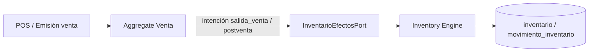

# Arquitectura — overview

**Objetivo:** Describir las capas reales de LibroSys para Inventario y Ventas.

---

## Descripción

LibroSys es un ERP de librería (Joselito) con:

| Capa | Tecnología | Ubicación |
|------|------------|-----------|
| Frontend | React + TypeScript + Vite | `Frontend/` |
| Backend HTTP | Express (Node) | `backend/server.js` |
| Módulos DDD | TypeScript | `backend/src/modules/{inventario,ventas}/` |
| Persistencia definitiva | MySQL | `database/mysql/{inventario,ventas}_definitivo/` |
| Legacy / catálogo | SQL Server (mssql) vía `backend/db` | productos legacy `/api/productos` |

Los módulos **Inventario** y **Ventas** son DDD y se montan en el mismo proceso Express. Inventario se monta primero; Ventas recibe la composición compartida del Inventory Engine.

```
browser (Vite :5173)
    → HTTP JSON
backend (:3001)
    ├── /api/productos          (legacy)
    ├── /api/inventario/*       (DDD Inventario + Engine)
    └── /api/v1/ventas/*        (DDD Ventas → Engine compartido)
         ↓
      MySQL librosys (packs definitivos)
```

---

## Capas internas (DDD)

Cada módulo (`inventario`, `ventas`) sigue:

```
infrastructure/api/http     → Controllers, routes, validators, OpenAPI
infrastructure/composition  → Composition root (wiring)
infrastructure/persistence  → Repositorios MySQL / in-memory
infrastructure/adapters     → Puertos externos (Engine, clientes, permisos)
application/                → Services, handlers, commands, queries, DTOs
domain/                     → Aggregates, entities, VOs, policies, events
```

**Regla:** el dominio no conoce Express ni SQL. Los efectos de stock **solo** pasan por el Inventory Engine.

---

## Montaje runtime

Archivo: `backend/server.js`

1. `mountInventarioModule(app)` → composition Inventario + Engine  
2. `mountVentasModule(app, inventarioComposition)` → Ventas **exige** Engine; falla si falta  

Ventas **no** tiene stub local de existencias.

---

## Frontend

| Área | Ruta app | Código |
|------|----------|--------|
| Inventario | `/inventario/*` | `Frontend/src/modules/inventario/` |
| Ventas | `/ventas/*` | `Frontend/src/modules/ventas/` |
| Layout Ventas | tabs | Dashboard · POS · Facturas · Notas de Crédito |

Flags típicos (`.env`):

```env
VITE_API_URL=http://localhost:3001
VITE_USE_API_INVENTARIO=true
VITE_USE_API_VENTAS=true
```

---

## Persistencia

| Pack | Path | Uso |
|------|------|-----|
| INV-DB | `database/mysql/inventario_definitivo/` | Existencias, movimientos, TRF, ajustes, conteos, descartes |
| VEN-DB | `database/mysql/ventas_definitivo/` | ventas, líneas, pagos, cambios, NC, historial |

Instalación: `database/mysql/install_all.sql` (o instaladores por módulo).

Detalle: [../database/README.md](../database/README.md)

---

## Comunicación Inventario ↔ Ventas



- Emisión / anulación / cambios con efecto físico → Engine.  
- Emisión / anulación / aplicación de **Nota de Crédito** → **no** mueve stock (solo comercial).  

Ver [../sales/integration-inventory.md](../sales/integration-inventory.md).

---

## Notas

- Design System: [../design-system.md](../design-system.md)  
- Decisiones: [../decisions/README.md](../decisions/README.md)  
