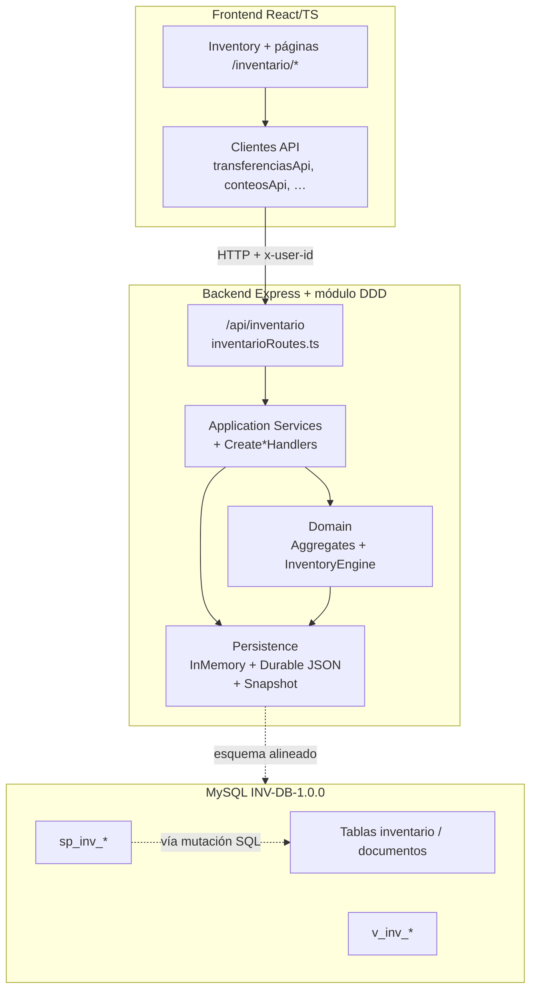

# 02 — Arquitectura del módulo Inventario

---

## 1. Vista general



---

## 2. Frontend

### 2.1 Estructura

```
Frontend/src/modules/inventario/
  pages/          # Inventory shell + crear/detalle/fases
  tabs/           # General, Movimientos, Transferencias, Conteos,
                  # Ajustes, Descartes, Kardex, Auditoría
  components/     # InventoryDashboard, InventoryTabNav, DetailPageShell
  types/          # inventoryUi.ts
  utils/          # statusBadges.ts
  data/           # inventoryDomainMock.ts (fallback si API falla)
```

Re-exports de páginas: `Frontend/src/pages/inventario/*`.

### 2.2 Shell

`Inventory.tsx` carga en paralelo (vía `Promise.allSettled`) productos, movimientos, transferencias, conteos, ajustes, descartes, kardex, auditoría y KPIs. Si un endpoint falla, usa mock solo para esa fuente. Navegación por `?tab=`.

### 2.3 Decisión UX

Procesos principales = **pantallas completas** (`FormPageLayout` / `DetailPageShell`). Los tabs listan y navegan; no concentran workflows en `FormDialog`.

---

## 3. Backend (DDD)

### 3.1 Capas

| Capa | Responsabilidad | Ruta |
|------|-----------------|------|
| **Domain** | Agregados, entidades, VOs, `InventoryEngine`, errores, eventos | `backend/src/modules/inventario/domain/` |
| **Application** | Casos de uso, handlers Create Conteo/Descarte, QueryService, puertos | `…/application/` |
| **Infrastructure** | HTTP, composición, repos in-memory, stores durables, auth, observability | `…/infrastructure/` |

### 3.2 Montaje

1. `backend/server.js` registra `tsx` y llama `mountInventarioModule(app)`.
2. `createInventarioComposition({ durableConteo: true, durableDescarte: true })`.
3. `seedInventarioJoselitoCompleto(composition)`.
4. Router en `/api/inventario` + OpenAPI en `/api/inventario/openapi.json`.
5. Usuarios de prueba con permisos: `admin`, `inventario`, `user-1`.

### 3.3 Inventory Engine

Único servicio de dominio autorizado a **mutar `Existencia`**. Valida versión, actor, documento origen, producto activo, bloqueo de almacén e idempotencia; produce:

- `MovimientoInventario`
- `Kardex` (1:1 con el movimiento)
- `AuditoriaMovimiento`
- eventos de dominio / outbox

Los Application Services orquestan documentos y **delegan** la mutación de stock al Engine en despachar/recibir/aplicar/revertir.

### 3.4 Persistencia runtime

| Mecanismo | Archivo / rol |
|-----------|----------------|
| `InMemoryDatabaseAdapter` + UoW | Estado transaccional en proceso |
| `DurableInventorySnapshotStore` | `backend/data/inventario/inventario_snapshot.json` (commit) |
| `DurableConteoFileStore` | `conteo_fisico_store.json` |
| `DurableDescarteCreateStore` | `descarte_store.json` (agregado + metadata de creación) |

MySQL **INV-DB-1.0.0** refleja el mismo modelo físico para despliegue relacional; el adaptador MySQL live del DDD no es el runtime por defecto del servidor Node actual.

---

## 4. Autenticación / autorización HTTP

Headers obligatorios en las rutas del módulo:

- `x-user-id` — si falta → **401**
- `x-user-roles` — lista separada por comas (ej. `admin`)

Permisos por operación (ej. `transferencias:crear`, `conteos:abrir`). Rol `admin` tiene bypass en el adaptador in-memory.

Los clientes frontend de Inventario envían típicamente:

```http
x-user-id: inventario
x-user-roles: admin
```

---

## 5. Relación con el resto del ERP

- Catálogos compartidos MySQL: `productos`, `categorias`, `editoriales`, `almacenes`, `sucursales`, `usuarios`.
- Triggers legados de Ventas/Recepciones siguen pudiendo llamar `sp_actualizar_inventario` (recreado en el pack definitivo para compatibilidad de ENUM).
- El menú lateral **no** expone Transferencias como módulo; solo Inventario → pestaña Transferencias.

---

## 6. Decisiones de diseño relevantes

| Decisión | Motivo |
|----------|--------|
| Engine como único mutador de stock | Evitar inconsistencias entre documentos y saldos |
| Crear conteo/descarte sin Engine | Separar captura documental de aplicación física |
| Snapshot JSON + stores | Pruebas intensivas sin depender de MySQL en cada arranque Node |
| `dominio_id` en tablas MySQL | No romper FKs INT del ERP ni contratos UUID de Application Services |
| Transferencias dentro de Inventario | Dominio aprobado: transferencia es proceso de stock, no bounded context aparte |
