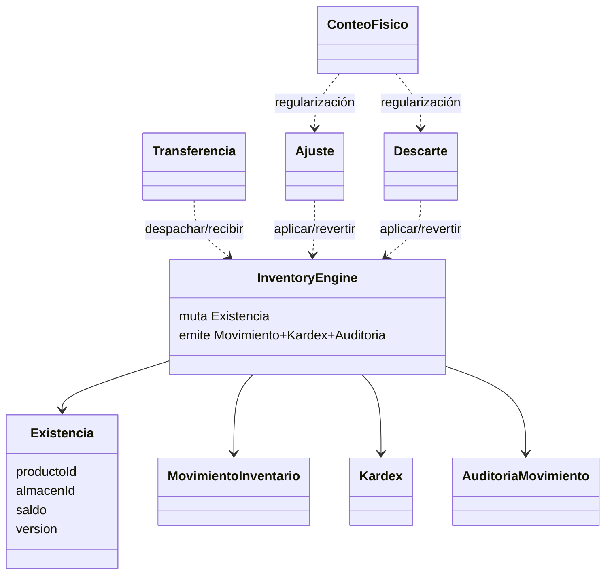

# 04 — Modelo de dominio

Fuente de verdad TypeScript: `backend/src/modules/inventario/domain/`.

Este documento describe **exactamente** los agregados, entidades y value objects implementados.

---

## 1. Mapa del dominio

---

## 2. Value objects relevantes

### `TipoMovimiento`
`transferencia_salida | transferencia_entrada | descarte | ajuste | recepcion | venta | devolucion_entrada | compensacion`

### `DocumentoOrigenRef`
Tipos: `transferencia | descarte | ajuste | conteo | recepcion | venta | devolucion | compensacion | sistema`  
Campos: tipo, id, línea opcional.

### `Cantidad`, `Saldo`, `Version`, `IdempotencyKey`
Garantizan enteros válidos, no-negatividad del saldo y claves de replay.

---

## 3. Entidad `Existencia`

| Campo | Significado |
|-------|-------------|
| `productoId`, `almacenId` | Clave lógica de stock |
| `saldo` | Unidades disponibles |
| `version` | Optimistic locking |

Métodos: `crear`, `assertVersion`, `incrementar`, `decrementar`, `toSnapshot`.  
**Solo el Engine** debe mutarla en flujos normales.

En MySQL se materializa como tabla `inventario` (`stock` = saldo).

---

## 4. Entidades de hecho

### `MovimientoInventario`
Hecho inmutable de un cambio de stock (tipo, cantidad, saldos, documento, usuario, idempotency).

### `Kardex`
Proyección 1:1 creada con `Kardex.desdeMovimiento`.

### `AuditoriaMovimiento`
`tipoAccion`: `movimiento | aplicacion | aprobacion | rechazo | cancelacion | reversion | error`  
`resultado`: `OK | RECHAZADO | ERROR`

---

## 5. Agregado `Transferencia`

**Estados:** `borrador | solicitada | en_transito | recibida_parcial | recibida | cancelada`

**Línea:** solicitada, despachada, recibida, faltante, dañada.

| Método | Transición |
|--------|------------|
| `crear({ solicitar? })` | `borrador` si `solicitar=false`; si no `solicitada` |
| `solicitar` | borrador → solicitada |
| `cancelar` | borrador\|solicitada → cancelada |
| `despachar` | solicitada → en_transito |
| `recibir` | en_transito\|recibida_parcial → recibida_parcial\|recibida |

Archivo: `domain/aggregates/Transferencia.ts`

---

## 6. Agregado `Ajuste`

**Estados:** `borrador | solicitado | aprobado | rechazado | aplicado | cancelado | revertido`  
**Tipos:** `positivo | negativo | digitacion | conteo | error_documental`

| Método | Efecto |
|--------|--------|
| `crear` | borrador o solicitado |
| `solicitar` / `rechazar` / `cancelar` | ciclo previo a aprobación |
| `aprobar` | solicitado → aprobado |
| `marcarAplicado` | aprobado → aplicado (App Service + Engine antes) |
| `marcarRevertido` | aplicado → revertido |

Archivo: `domain/aggregates/Ajuste.ts`

---

## 7. Agregado `Descarte`

Misma máquina de estados que Ajuste.  
Regla adicional en `aprobar`: **aprobador ≠ solicitante**.  
Líneas con `motivoCodigo` obligatorio.

Archivo: `domain/aggregates/Descarte.ts`

---

## 8. Agregado `ConteoFisico`

**Estados documento:** `borrador | abierto | en_conteo | en_revision | cerrado | cancelado`  
**Tipos:** `general | parcial | ciclico | extraordinario`  
**Estados línea:** `pendiente | contada | en_reconteo | revisada | regularizada`  
**Clasificación:** `cuadra | sobrante | faltante | dano | investigacion`

| Método | Notas |
|--------|-------|
| `abrir` | Snapshot + `bloqueoActivo=true` |
| `registrarLinea` | Captura cantidades |
| `iniciarReconteo` | Marca líneas en `en_reconteo` |
| `enviarARevision` | Exige líneas no pendientes |
| `clasificarLinea` | Reglas cuadra/diferencia |
| `marcarLineaRegularizada` | Vincula ajuste/descarte |
| `cerrar` | Exige regularización completa; libera bloqueo |
| `cancelar` | Solo borrador/abierto; libera bloqueo |

**No llama al Engine.** Archivo: `domain/aggregates/ConteoFisico.ts`

---

## 9. `InventoryEngine`

Servicio de dominio (`domain/services/InventoryEngine.ts`). Operaciones típicas usadas por Application Services:

- Salidas/entradas de transferencia
- `aplicarDescarte`
- `aplicarAjuste`
- Compensaciones / devoluciones de entrada en reversiones

Produce siempre el cuarteto: existencia actualizada + movimiento + kardex + auditoría.

---

## 10. Compatibilidad con MySQL

| Dominio | Tabla MySQL |
|---------|-------------|
| Existencia | `inventario` |
| Movimiento / Kardex | `movimiento_inventario` (+ vista `v_inv_kardex`) |
| Transferencia | `transferencia` + `detalle_transferencia` |
| Ajuste | `ajuste` + `ajuste_detalle` |
| Descarte | `descarte` + `descarte_detalle` + `descarte_evidencia` |
| ConteoFisico | `conteo_fisico` + `snapshot_conteo` + `linea_conteo` + … |
| AuditoriaMovimiento | `auditoria_inventario` |

Columna puente: `dominio_id CHAR(36)`.
