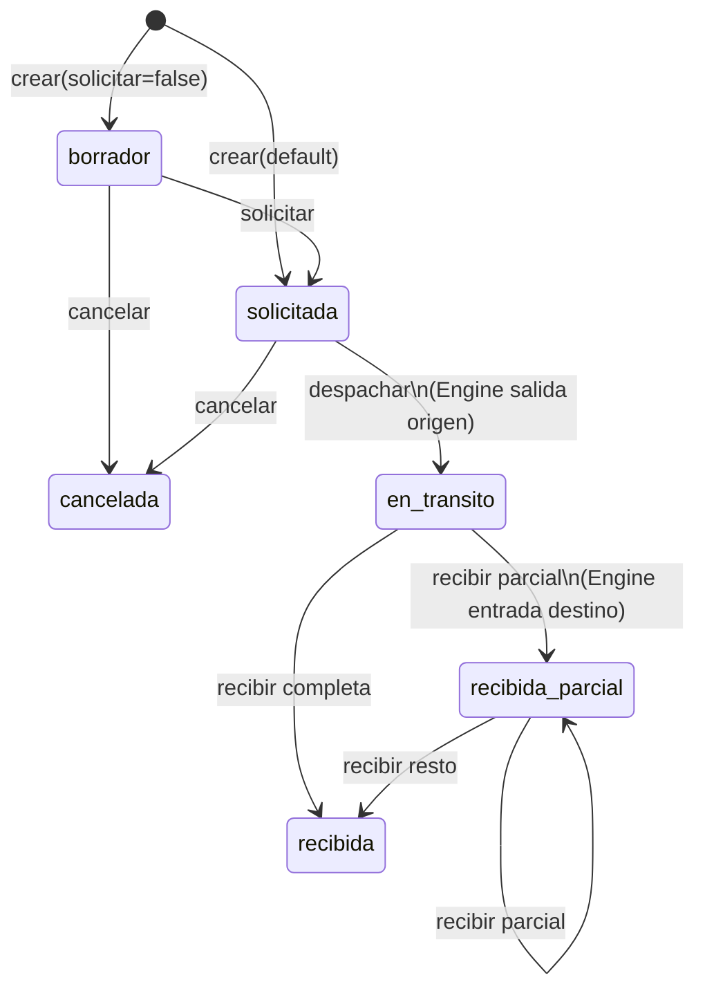
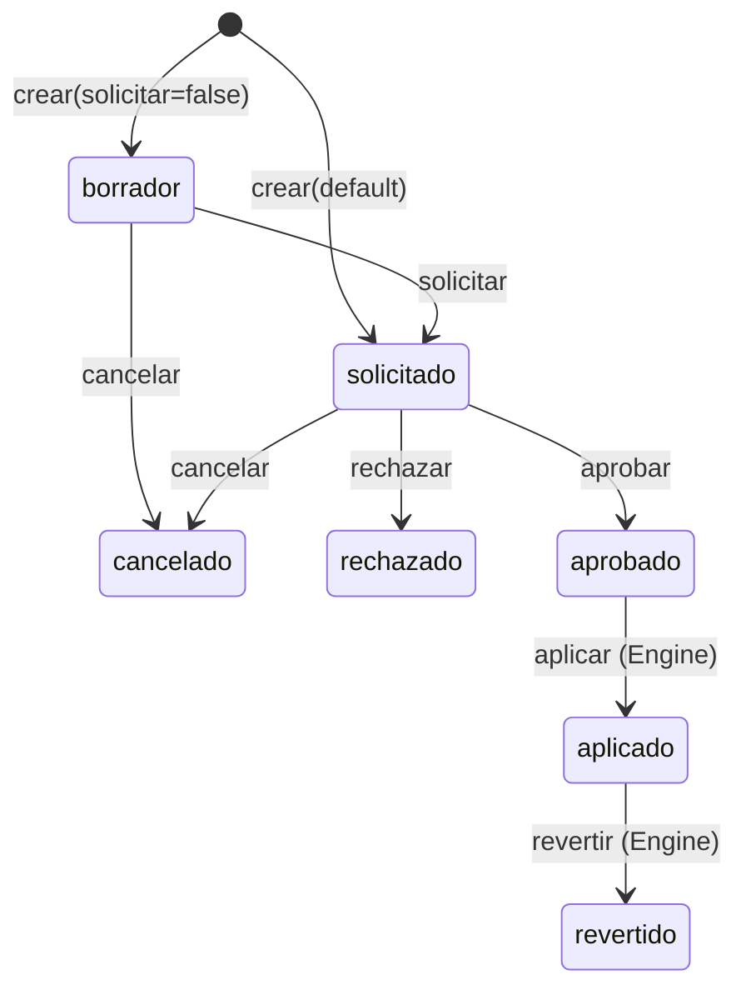
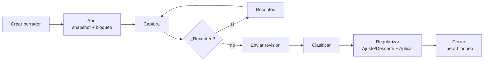
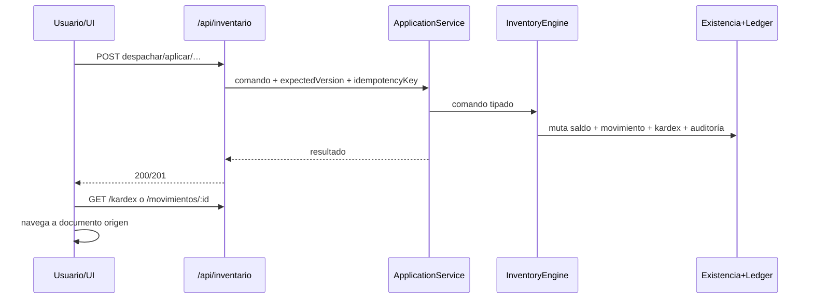

# 06 — Flujos operativos

Diagramas de los flujos **realmente implementados**.

---

## 1. Transferencia entre almacenes

**Pantallas:**  
`/inventario/transferencias/nuevo` → `/inventario/transferencias/:id` → `/inventario/transferencias/:id/recepcion`

---

## 2. Ajuste de inventario

**Pantallas:** `/inventario/ajustes/nuevo` → `/inventario/ajustes/:id`

---

## 3. Descarte

Igual que ajuste en estados. Diferencias:

- Flujo ERP completo nace en **borrador** (`CreateDescarteHandler`).
- Evidencias antes de solicitar.
- Aprobador distinto del solicitante.
- Aplicar genera movimiento tipo `descarte`.

**Pantallas:** `/inventario/descartes/nuevo` → `/inventario/descartes/:id`

---

## 4. Conteo físico (ciclo completo)

**Pantallas por fase:**

| Fase | Ruta |
|------|------|
| Crear | `/inventario/conteos/nuevo` |
| Gestión | `/inventario/conteos/:id` |
| Captura | `…/captura` |
| Reconteo | `…/reconteo` |
| Revisión | `…/revision` |
| Clasificación | `…/clasificacion` |
| Regularización | `…/regularizacion` |

Durante `abierto`/`en_conteo`/`en_revision` el almacén puede quedar bloqueado para otros movimientos (salvo bypass del propio conteo al aplicar regularizaciones).

---

## 5. Movimiento → Kardex → Documento

---

## 6. Lectura operativa diaria

1. Abrir `/inventario` (dashboard + tab General).  
2. Revisar KPIs (`GET /dashboard`).  
3. Explorar movimientos/kardex.  
4. Atender transferencias/conteos/ajustes/descartes pendientes desde sus tabs.  
5. Auditar con filtros y exportar si se requiere.
