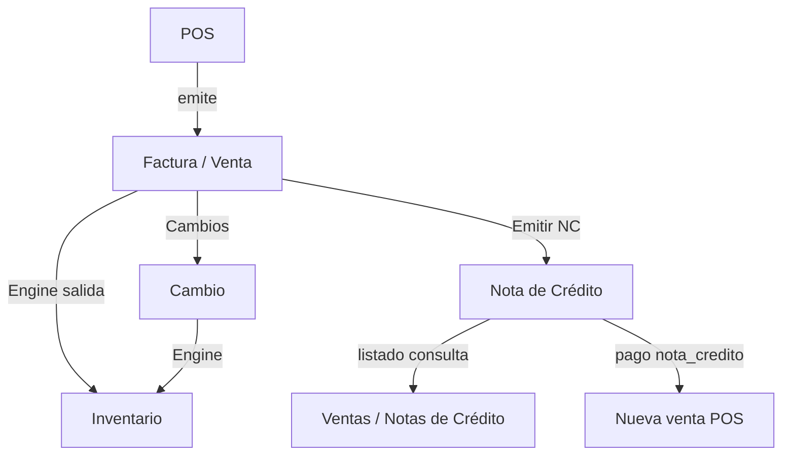

# Ventas — Flujos

**Objetivo:** Secuencias reales implementadas.

---

## 1. Emisión (POS)

```
Cliente (opcional) → líneas → pagos → POST /api/v1/ventas | /pago | /pago-mixto
  → Venta.emitir
  → InventarioEfectos.aplicar(salida_venta)
  → save
  → si pagos nota_credito → aplicarNcEnOrigen(notaCreditoId)
```

Modos FE:

| Endpoint | Uso |
|----------|-----|
| `POST /` | Emisión genérica |
| `POST /pago` | Exactamente 1 pago |
| `POST /pago-mixto` | ≥ 2 pagos |

---

## 2. Emisión de Nota de Crédito

```
Facturas → abrir factura → tab Notas de Crédito → Emitir
  → POST /api/v1/ventas/:id/notas-credito { monto, motivo, expectedVersion }
```

Tras emitir, la NC aparece en:

1. Expediente de la factura  
2. Listado administrativo `/ventas/notas-credito`  
3. Crédito disponible del cliente (si saldo > 0)

**No** hay creación desde el listado NC ni sin factura.

---

## 3. Aplicación de NC en nueva venta

```
POS → cliente con NC disponible
  → selector de NC (o diálogo de crédito)
  → pago formaPago=nota_credito + notaCreditoId
  → emitir
  → backend aplica saldo en factura origen
```

---

## 4. Cambio (postventa)

```
Expediente → tab Cambios → asistente
  → POST /:id/cambios
  → efectos Engine (entrada/salida según líneas)
  → opcional pago diferencia / NC compensación
```

No existe flujo independiente “Devoluciones”.

---

## 5. Anulación de factura

```
POST /:id/anular { motivo, idempotencyKey, expectedVersion }
  → permiso anular
  → revierte stock vía Engine cuando aplica
```

---

## Diagrama resumen


