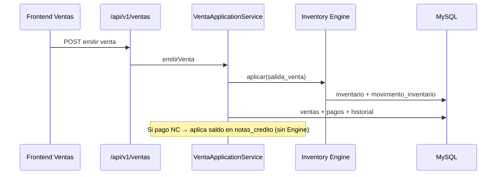

# Ventas ↔ Inventario

**Objetivo:** Cómo se comunican los módulos hoy.

---

## Descripción

Inventario es el **único** dueño del stock. Ventas no escribe tablas de existencia.

Puerto: `InventarioEfectosPort` / `InventarioConsultaPort`  
Adaptadores: Engine compartido montado en `server.js`.

---

## Qué SÍ modifica stock

| Proceso Ventas | Efecto Engine típico |
|----------------|----------------------|
| Emitir venta | `salida` / tipo movimiento venta |
| Anular venta | compensación / entrada según política |
| Registrar cambio (con líneas) | entrada de devueltos + salida de nuevos |

Consulta de movimientos ligados a factura: `GET /api/v1/ventas/:id/inventario`.

---

## Qué NO modifica stock

| Proceso | Motivo |
|---------|--------|
| Emitir Nota de Crédito | Documento comercial |
| Anular NC | Comercial |
| Aplicar NC como pago | Solo reduce saldo de crédito |
| Reimprimir factura | Solo historial |
| Listar / consultar NC | Solo lectura |

---

## Tablas involucradas

**Ventas:** `ventas`, `venta_lineas`, `pagos`, `cambios`, `notas_credito`, `nota_credito_aplicaciones`, `historial_ventas`

**Inventario (vía Engine):** `inventario` (existencias), `movimiento_inventario` (ledger), más documentos propios si el efecto es ajuste/TRF/etc. Para venta: movimiento con `documento_tipo` asociado a la venta.

---

## Diagrama

