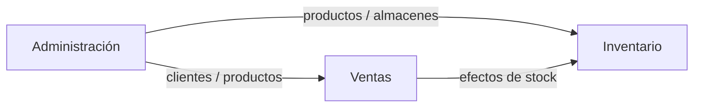

# 01 — Visión del proyecto

## Objetivo

Explicar qué problema resuelve LibroSys y qué está dentro / fuera del alcance actual.

---

## Descripción

LibroSys digitaliza la operación de una librería multi-sucursal:

- Vender (POS) y facturar.
- Consultar y anular facturas.
- Gestionar cambios postventa.
- Emitir y aplicar notas de crédito derivadas de facturas.
- Controlar stock, transferencias, ajustes, conteos y descartes.

El diseño favorece **límites de módulo claros**: Inventario no vende; Ventas no es dueño del stock; los clientes viven en Administración.

---

## Principios de producto

1. **Una fuente de verdad por concepto** (stock → Engine; clientes → Administración; factura → agregado Venta).  
2. **Documentos padre/hijo explícitos** (Factura → Nota de Crédito).  
3. **UI operativa sin duplicar maestros** en cada módulo.  
4. **Código = verdad**; la documentación (incluida esta guía) se actualiza después de implementar.

---

## Qué está terminado

- Inventario DDD + Inventory Engine + pantallas + API `/api/inventario`.  
- Ventas DDD + POS + Facturas + listado consulta de NC + integración Engine + API `/api/v1/ventas`.

---

## Qué falta (no documentar como hecho)

- Módulo Compras (órdenes, recepciones, facturas proveedor).  
- Cierre de Importaciones / Editoriales / Eventos como módulos de dominio.  
- Unificación total legacy SQL Server vs MySQL (aún coexisten rutas legacy de productos).

---

## Relaciones

---

## Notas

Para profundidad técnica: `docs/architecture/`, `docs/inventory/`, `docs/sales/`.
