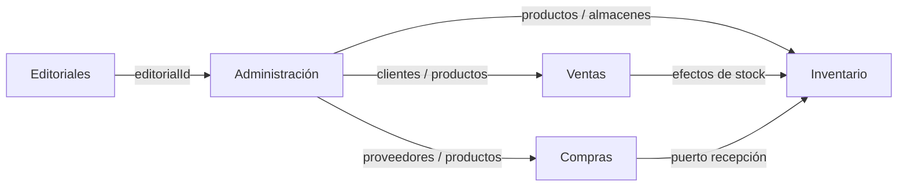

# 01 — Visión del proyecto

## Objetivo

Explicar qué problema resuelve LibroSys y qué está dentro / fuera del alcance actual.

---

## Descripción

LibroSys digitaliza la operación de una librería multi-sucursal:

- Vender (POS) y facturar.
- Consultar y anular facturas.
- Gestionar cambios postventa.
- Emitir y aplicar notas de crédito derivadas de facturas.
- Controlar stock, transferencias, ajustes, conteos y descartes.

El diseño favorece **límites de módulo claros**: Inventario no vende; Ventas no es dueño del stock; los clientes viven en Administración.

---

## Principios de producto

1. **Una fuente de verdad por concepto** (stock → Engine; clientes → Administración; factura → agregado Venta).  
2. **Documentos padre/hijo explícitos** (Factura → Nota de Crédito).  
3. **UI operativa sin duplicar maestros** en cada módulo.  
4. **Código = verdad**; `guia/` es la documentación oficial y se actualiza **junto con** cada cambio importante de módulo (ver [CONVENCIONES](./CONVENCIONES.md)).

---

## Qué está documentado en `guia/modulos/`

- **Inventario** — DDD + Engine + API `/api/inventario`
- **Compras** — Express + FE (OC, recepciones, FP)
- **Ventas** — DDD + POS/facturas/NC + API `/api/v1/ventas`
- **Editoriales** — Express + FE (maestro publishers)

---

## Pendiente de documentar / consolidar

- Resto de módulos en `Modulos/` (Admin, Usuarios, Configuración, Importaciones, Eventos, Reportes, …).  
- Unificación total de persistencia (caminos in-memory / MySQL legacy vs pack SQL Server).

---

## Relaciones

```mermaid
flowchart LR
  Admin[Administración]
  Inv[Inventario]
  Ven[Ventas]
  Com[Compras]
  Ed[Editoriales]

  Admin -->|clientes / productos| Ven
  Admin -->|productos / almacenes| Inv
  Admin -->|proveedores / productos| Com
  Ed -->|editorialId| Admin
  Ven -->|efectos de stock| Inv
  Com -->|puerto recepción| Inv
```

---

## Notas

La referencia oficial para desarrolladores es **`guia/`**. Material histórico en `docs/` puede existir; ante conflicto, prevalece `guia/` alineada al código en `Modulos/`.
