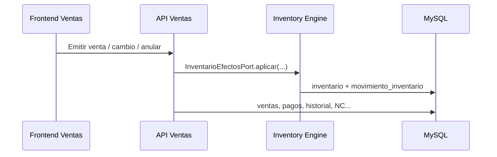

# 02 — Arquitectura general

## Objetivo

Describir cómo está armado LibroSys hoy (FE, BE, API, persistencia).

---

## Descripción

```
Frontend (Vite :5173)
    │  HTTP JSON  (VITE_API_URL)
    ▼
backend/server.js (:3001)
    ├── /api/productos          ← legacy SQL Server
    ├── /api/inventario/*       ← DDD Inventario + Engine
    └── /api/v1/ventas/*        ← DDD Ventas (Engine compartido)
         │
         ▼
    MySQL librosys  (packs inventario_definitivo + ventas_definitivo)
```

**Orden de montaje obligatorio:** Inventario primero; Ventas recibe la composition del Engine. Sin Engine, Ventas no arranca.

---

## Capas DDD (Inventario y Ventas)

| Capa | Responsabilidad |
|------|-----------------|
| `domain/` | Agregados, entidades, VOs, políticas, errores |
| `application/` | Services, handlers, commands, queries, DTOs |
| `infrastructure/api` | Routes, controllers, validators, OpenAPI |
| `infrastructure/persistence` | Repositorios MySQL / in-memory |
| `infrastructure/adapters` | Engine, permisos, clientes ACL |
| `infrastructure/composition` | Wiring |

El dominio **no** conoce Express ni SQL.

---

## Frontend

| Área | Path |
|------|------|
| Inventario | `Frontend/src/modules/inventario/` → rutas `/inventario/*` |
| Ventas | `Frontend/src/modules/ventas/` → `/ventas/*` |
| Layout Ventas | Dashboard · POS · Facturas · Notas de Crédito |

Flags: `VITE_USE_API_INVENTARIO`, `VITE_USE_API_VENTAS`.

---

## Conexión entre módulos



Ventas **nunca** escribe existencias directo. NC comercial **no** llama al Engine.

---

## Arquitectura

Detalle: [`docs/architecture/overview.md`](../docs/architecture/overview.md).

---

## Notas

Coexisten SQL Server (legacy productos) y MySQL (packs DDD). Al onboardear, no asumir un solo motor para todo.
