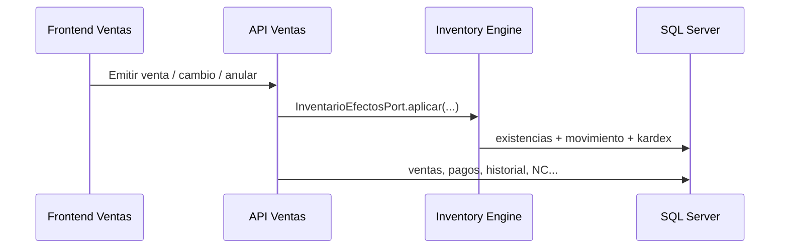

# 02 — Arquitectura general

## Objetivo

Describir cómo está armado LibroSys hoy: shells de ejecución, módulos de negocio, compartido y persistencia.

---

## Mapa del monorepo

```
Proyecto/
├── guia/                  # Documentación oficial
├── Modulos/<Dominio>/     # Frontend + Backend + Database por dominio
├── Compartido/            # Código multi-módulo
├── Infraestructura/       # Mapa del shell (README)
├── Frontend/              # Shell Vite/React
├── backend/               # Shell Express
└── database/sqlserver/    # Instalador oficial SQL Server
```

Cada dominio sigue:

```
Modulos/<Nombre>/{ Frontend/, Backend/, Database/, README.md }
```

---

## Shells vs negocio

| Capa | Ubicación | Contiene |
|------|-----------|----------|
| Shell FE | `Frontend/` | Vite, rutas, layout, UI kit, providers de app, shims |
| Shell BE | `backend/` | `server.js`, db, middlewares, Express clásico pendiente de migrar |
| Negocio FE | `Modulos/*/Frontend` | Pantallas y clientes API del dominio |
| Negocio BE DDD | `Modulos/{Inventario,Ventas}/Backend` | domain / application / infrastructure |
| Negocio BE Express | `backend/**` (Compras, Editoriales, Admin…) | Documentado en `Modulos/*/Backend/README.md` |
| Compartido | `Compartido/` | DetailPageShell, validators, stateMachines, useProductosMaestro |

### Junctions (Windows)

| Origen | Destino |
|--------|---------|
| `Frontend/src/modules/<nombre>` | `Modulos/<Nombre>/Frontend` |
| `Frontend/src/compartido` | `Compartido/` |
| `backend/src/modules/inventario` | `Modulos/Inventario/Backend` |
| `backend/src/modules/ventas` | `Modulos/Ventas/Backend` |

Arranque FE/BE usa `preserveSymlinks` / `register-paths.js` para resolver dependencias correctamente.

---

## Runtime HTTP

```
Frontend (Vite :5173)
    │  HTTP JSON  (VITE_API_URL)
    ▼
backend/server.js (:3001)
    ├── /api/productos, /categorias, …     ← Express maestros (Admin)
    ├── /api/compras, /api/v1/compras      ← Express Compras
    ├── /api/editoriales                   ← Express Editoriales
    ├── /api/inventario/*                  ← DDD Inventario + Engine
    └── /api/v1/ventas/*                   ← DDD Ventas (Engine compartido)
         │
         ▼
    SQL Server  (database/sqlserver/install.sql)
```

**Orden de montaje obligatorio:** Inventario primero; Ventas recibe la composition del Engine.

---

## Capas DDD (Inventario y Ventas)

| Capa | Responsabilidad |
|------|-----------------|
| `domain/` | Agregados, entidades, VOs, políticas, errores |
| `application/` | Services, handlers, commands, queries, DTOs |
| `infrastructure/api` | Routes, controllers, validators, OpenAPI |
| `infrastructure/persistence` | Repositorios / in-memory |
| `infrastructure/adapters` | Engine, permisos, ACL |
| `infrastructure/composition` | Wiring |

El dominio **no** conoce Express ni SQL.

---

## Conexión entre módulos (ejemplo Ventas → Inventario)


```mermaid
sequenceDiagram
  participant FE as Frontend Ventas
  participant V as API Ventas
  participant E as Inventory Engine
  participant DB as SQL Server

  FE->>V: Emitir venta / cambio / anular
  V->>E: InventarioEfectosPort.aplicar(...)
  E->>DB: existencias + movimiento + kardex
  V->>DB: ventas, pagos, historial, NC...
```

Ventas **nunca** escribe existencias directo. NC comercial **no** llama al Engine.

---

## Documentación por módulo

- [Inventario](./modulos/Inventario/README.md)
- [Compras](./modulos/Compras/README.md)
- [Ventas](./modulos/Ventas/README.md)
- [Editoriales](./modulos/Editoriales/README.md)

Índice: [guia/README.md](./README.md).
