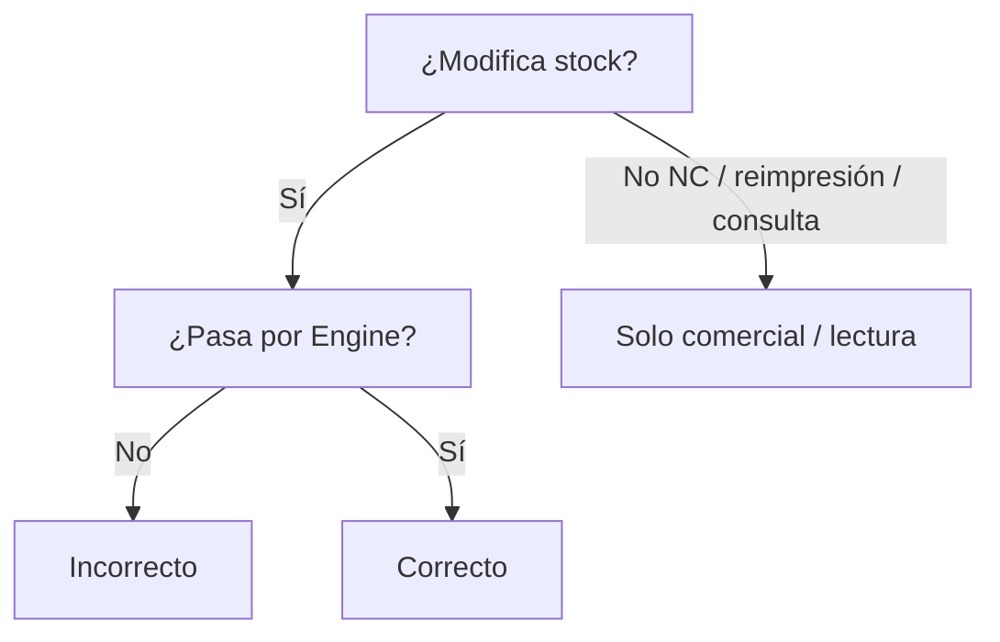

# 03 — Reglas de negocio

## Objetivo

Listar las reglas **vigentes e implementadas**. No son deseos: están en código.

Catálogo técnico ampliado: [`docs/business-rules/`](../docs/business-rules/).

---

## Reglas cruzadas

| ID | Regla |
|----|--------|
| X-01 | Inventario es el **único** responsable del stock. |
| X-02 | Todo movimiento de stock pasa por el **Inventory Engine**. |
| X-03 | Las facturas no modifican inventario directamente. |
| X-04 | Una Venta emitida **es** la Factura (mismo agregado). |
| X-05 | Una Nota de Crédito **siempre nace desde una Factura**. |
| X-06 | Emitir / anular / aplicar NC **no** mueve stock. |
| X-07 | Clientes pertenecen a **Administración**; Ventas solo consulta. |
| X-08 | No existe menú independiente de Devoluciones (va por Cambios). |
| X-09 | Pagos **no** usan campo Referencia; NC se identifica con `notaCreditoId`. |

---

## Inventario (resumen)

- Stock producto × almacén; no negativo; enteros.  
- Concurrencia optimista (`version`).  
- Idempotencia en mutaciones Engine.  
- Transferencias, ajustes, descartes y conteos tienen máquinas de estado propias; **aplicar** = Engine.  
- Ledger: `movimiento_inventario`.

---

## Ventas (resumen)

- Menú: Dashboard · POS · Facturas · Notas de Crédito (**consulta**).  
- Emisión de NC solo en expediente de factura.  
- Formas de pago: efectivo, tarjeta, transferencia, nota_credito.  
- Pago mixto ≥ 2 pagos.  
- Anular NC solo sin aplicaciones.  
- Estados NC UI: Disponible / Parcialmente utilizada / Utilizada / Anulada.

---

## Flujo mental rápido

---

## Notas

Si una regla no está en código, no pertenece a este documento.
