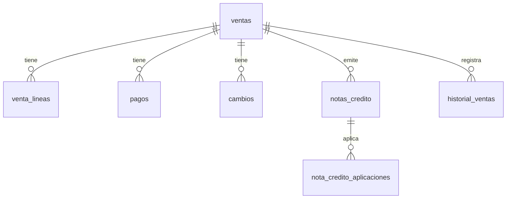

# 04 — Base de datos

## Objetivo

Describir el esquema **real** usado por Inventario y Ventas (MySQL `librosys`).

Detalle: [`docs/database/`](../docs/database/) · packs en `database/mysql/`.

---

## Descripción

| Pack | Carpeta | Uso |
|------|---------|-----|
| Inventario | `database/mysql/inventario_definitivo/` | Existencias, movimientos, TRF, ajustes, conteos, descartes |
| Ventas | `database/mysql/ventas_definitivo/` | ventas, líneas, pagos, cambios, NC, historial |

Instalación: `install_all.sql` o instaladores por módulo.

---

## Inventario — tablas clave

| Tabla | Rol |
|-------|-----|
| `inventario` | Existencia producto×almacén |
| `movimiento_inventario` | Ledger |
| `transferencia` / `detalle_transferencia` | TRF |
| `ajuste` / `ajuste_detalle` | Ajustes |
| `conteo_fisico` + líneas/snapshot | Conteos |
| `descarte` + detalle/evidencia | Descartes |
| `productos`, `almacenes` | Catálogo ERP (alterados por el pack) |

---

## Ventas — tablas clave

| Tabla | Rol |
|-------|-----|
| `ventas` | Factura (Aggregate Root) |
| `venta_lineas` | Líneas |
| `pagos` | Pagos (`forma_pago`, `nota_credito_id`; **sin** `referencia`) |
| `cambios` | Postventa |
| `notas_credito` | NC ligadas a `venta_id` |
| `nota_credito_aplicaciones` | Aplicaciones a ventas destino |
| `historial_ventas` | Auditoría comercial |
| `venta_clientes` | ACL identidad para Ventas |

Legacy `venta` / `detalle_venta`: **no** usadas por el pack definitivo.

---

## Relaciones

Stock ↔ Ventas: vínculo **lógico** vía Engine (`documento_*`), no FK obligatoria en `pagos`.

---

## Nota SQL Server

`/api/productos` y `/api/test-db` aún pueden usar SQL Server. No confundir con el pack MySQL DDD.

---

## Notas

Scripts relevantes Ventas: `11_pagos_nota_credito_id.sql`, `12_pagos_drop_referencia.sql`.
