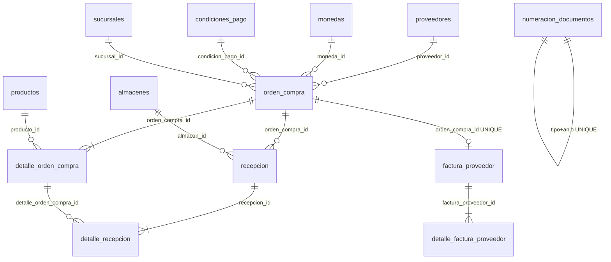
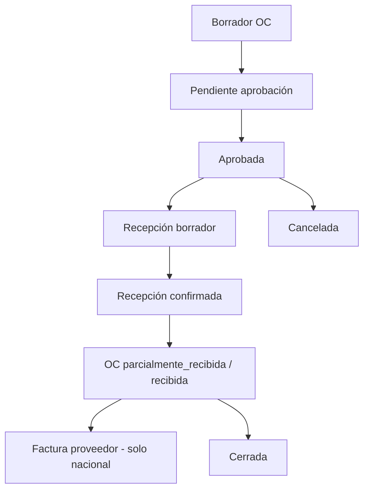

# Módulo — Compras

## Objetivo

Gestionar el ciclo documental de abastecimiento nacional e internacional de Librería Joselito:

**Orden de Compra → Recepción → Factura del Proveedor**

Cada documento conserva responsabilidad, tabla, modelo y servicio propios. No se fusionan.

---

## Responsabilidades

| Hace | No hace |
|------|---------|
| Órdenes de compra (nacional / internacional) | Factura comercial internacional (Importaciones) |
| Recepción de mercancía en almacén | Ser dueño del stock (Inventario via port) |
| Factura de proveedor (solo OC nacional, 1:1) | CRUD de proveedores/productos (Administración) |
| Condiciones de pago y numeración OC/REC/FP | Embarques, costeo, consolidación |

---

## Arquitectura por capas

```
HTTP Request
    ↓
Route  (/api/compras | /api/v1/compras)
    ↓
Middleware  authPlaceholder → [comprasAuth criticalWrite] → validate(http.*)
    ↓
Controller  (sendSuccess / sendPaginated)
    ↓
Service  (reglas de negocio + withTransaction)
    ↓
Repository  (SQL vía helpers _sql.js + dbExecutor)
    ↓
MySQL  (compras_definitivo COM-DB)
```

| Capa | Ubicación |
|------|-----------|
| Routes | `backend/routes/compras/` |
| Controllers | `backend/controllers/compras/` |
| Validators HTTP/domain | `backend/validators/compras/` |
| Services | `backend/services/compras/` |
| Repositories | `backend/repositories/compras/` |
| Models | `backend/models/compras/` |
| Frontend | `Frontend/src/modules/compras/` |
| Cliente API | `Frontend/src/services/api/comprasApi.ts` |

---

## Endpoints

Prefijos: `/api/compras` y alias `/api/v1/compras`.

Autenticación: header `x-user-id`.  
Mutaciones críticas: roles **ADMIN** o **COMPRAS** (`middlewares/comprasAuth.js`).

### Condiciones de pago — `/condiciones-pago`

| Método | Path | Notas |
|--------|------|-------|
| GET | `/` | Listado paginado |
| GET | `/:id` | Detalle |
| POST | `/` | Alta |
| PUT | `/:id` | Edición |
| PATCH | `/:id/estado` | Cambio de estado |

### Órdenes — `/ordenes`

| Método | Path | Notas |
|--------|------|-------|
| GET | `/` | Listado (cabecera) |
| GET | `/:id` | Cabecera + detalles |
| POST | `/` | Crea OC + líneas; código vía numeración |
| PUT | `/:id` | Solo borrador / pendiente_aprobacion |
| POST | `/:id/enviar-aprobacion` | borrador → pendiente_aprobacion |
| POST | `/:id/aprobar` | → aprobada |
| POST | `/:id/cancelar` | → cancelada |
| POST | `/:id/cerrar` | → cerrada |

### Recepciones — `/recepciones`

| Método | Path | Notas |
|--------|------|-------|
| GET | `/` | Listado |
| GET | `/:id` | Cabecera + detalles |
| POST | `/` | Crea recepción + líneas |
| PUT | `/:id` | Edición en borrador |
| POST | `/:id/confirmar` | Confirma; actualiza estado OC; port inventario |
| POST | `/:id/anular` | Anula |

### Facturas proveedor — `/facturas`

| Método | Path | Notas |
|--------|------|-------|
| GET | `/` | Listado |
| GET | `/por-orden/:ordenId` | 1:1 por OC |
| GET | `/:id` | Cabecera + detalles |
| POST | `/` | Registro (OC nacional) |
| PUT | `/:id` | Edición |
| POST | `/:id/anular` | Anula |

### Contrato de respuesta

```json
{ "success": true, "message": "…", "data": {}, "meta": { "page": 1, "pageSize": 50, "total": 0 } }
```

Error: `{ "success": false, "error": { "code", "message", "developerMessage", "details?", "traceId", … } }`

---

## Tablas y relaciones

Esquema canónico: `database/mysql/compras_definitivo/` (COM-DB-1.0.x).



| Tabla | Rol |
|-------|-----|
| `condiciones_pago` | Catálogo crédito/contado |
| `numeracion_documentos` | Correlativos OC / REC / FP por año |
| `orden_compra` | Cabecera OC |
| `detalle_orden_compra` | Líneas OC (`cantidad_solicitada` entera) |
| `recepcion` | Cabecera recepción (+ columnas bridge nullable FI/embarque) |
| `detalle_recepcion` | Líneas recibidas |
| `factura_proveedor` | FP nacional 1:1 con OC |
| `detalle_factura_proveedor` | Líneas FP |

Auditoría: `created_by`, `updated_by`, `created_at`, `updated_at`.

---

## Flujo documental



### Estados

**Orden de compra:** `borrador` → `pendiente_aprobacion` → `aprobada` → `parcialmente_recibida` / `recibida` → `cerrada` | `cancelada`

**Recepción:** `borrador` → `confirmada` | `anulada`

**Factura proveedor:** `registrada` / `contabilizada` / `anulada` + `estado_pago`: `pendiente` | `parcial` | `pagada`

### Internacional

- OC `tipo_compra = internacional` se aprueba en Compras.
- **No** admite `factura_proveedor`.
- Factura Internacional, embarque y costeo: módulo **Importaciones**.
- Bridge: columnas nullable en `recepcion`; FKs en `06_importaciones.sql`.

---

## Transacciones y concurrencia (FASE 9)

Todas las mutaciones multi-tabla usan `withTransaction` (`services/compras/_internal.js`):

- `BEGIN` → escrituras + auditoría en la misma `conn` → `COMMIT`
- Cualquier excepción → `ROLLBACK` completo

**Operaciones protegidas:** crear/actualizar OC, cambios de estado OC, crear/actualizar/confirmar/anular recepción, registrar/actualizar/anular FP, CRUD condiciones de pago.

### Numeración concurrente

1. `generarCodigo(tipo, conn)` exige conexión de TX.
2. `ensureRow` inserta fila `(tipo, anio)` si no existe (tolera carrera UNIQUE).
3. `SELECT … FOR UPDATE` bloquea la fila.
4. Incremento de `ultimo_numero` y formato `TYPE-YYYY-######`.

Única fuente de códigos OC / REC / FP. Sin generación paralela.

---

## Rendimiento

- Listados: `SELECT` cabecera + `LIMIT/OFFSET` (sin JOIN de detalles).
- Detalle: solo en `GET /:id` (2 consultas: cabecera + líneas).
- Índices: PK/UNIQUE + compuestos en `compras_definitivo/10_indices.sql`.
- Hidratación FE: listados en paralelo (sin N+1 `getById` por fila).

---

## Integración con Inventario

- Al confirmar recepción: `services/compras/_inventoryPort.js`.
- Stub por defecto (`COMPRAS_INVENTORY_STUB`); no escribe Inventario DDD hasta cablear el Engine.
- Compras **no** es dueño del stock.

---

## Integración con Importaciones

| Compras | Importaciones |
|---------|----------------|
| OC internacional aprobada | Factura internacional, embarque, costeo |
| Recepción (opcional vínculo FI/embarque) | Completa pipeline post-embarque |
| Rechaza FP si OC internacional | Dueña de FI |

Desacople documentado en `backend/services/compras/_importacionesBridge.js`.

---

## Pantallas Frontend

| Ruta | Rol |
|------|-----|
| `/compras` | Dashboard |
| `/compras/ordenes` | Listado OC |
| `/compras/ordenes/nuevo` | Alta OC |
| `/compras/recepciones` | Recepciones |
| `/compras/facturas` | Facturas proveedor |

Flag: `VITE_USE_API_COMPRAS=true`.

---

## Seed demo (Joselito)

- `OC-2026-000001` (recibida) → `REC-2026-000001` → `FP-2026-000001`
- `OC-INT-2026-000004` (aprobada) → bridge Importaciones + recepción INT borrador

Ver `database/mysql/compras_definitivo/README.md`.
