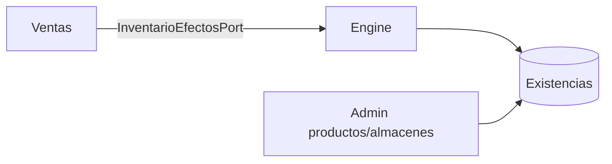

# Módulo — Inventario

## Objetivo

Ser el **único dueño del stock**: existencias por producto×almacén, movimientos, transferencias, ajustes, conteos físicos, descartes y consultas (kardex).

---

## Responsabilidades

| Hace | No hace |
|------|---------|
| Mutar stock vía Inventory Engine | Vender / facturar |
| TRF entre almacenes | Mantener maestro de clientes |
| Ajustes / descartes / conteos | Emitir notas de crédito |
| Exponer API `/api/inventario` | Escribir tablas `ventas` |

---

## Arquitectura

- Código: `backend/src/modules/inventario/`, `Frontend/src/modules/inventario/`  
- Capas DDD + **Inventory Engine** en dominio.  
- Montaje: `mountInventarioModule` en `server.js` → `/api/inventario`.  
- Persistencia: MySQL pack `inventario_definitivo` y/o stores JSON durables en demos.

Docs técnicas: [`docs/inventory/`](../../docs/inventory/).

---

## Pantallas (rutas FE)

Dashboard inventario, productos/ficha, transferencias, ajustes, conteos (fases), descartes, movimientos, kardex, auditoría, costeo UI.

Base: `/inventario/*`.

---

## Base de datos relacionada

`inventario`, `movimiento_inventario`, `transferencia`, `ajuste*`, `conteo_*`, `descarte*`, más catálogos `productos` / `almacenes`.

Ver [04_base_de_datos.md](../04_base_de_datos.md).

---

## Servicios

Application services / handlers por caso (transferencias, ajustes, descartes, conteos, consultas).  
HTTP → handlers → dominio → Engine → repositorio.

---

## Reglas

Stock no negativo; Engine único mutador; idempotencia; versionado; almacén bloqueado por conteo; documentos con máquina de estados.

Ver [03_reglas_de_negocio.md](../03_reglas_de_negocio.md).

---

## Flujos

Ver [07_flujos/movimientos_inventario.md](../07_flujos/movimientos_inventario.md).

---

## Relaciones con otros módulos

Ventas **consume** el Engine; no duplica lógica de stock.
