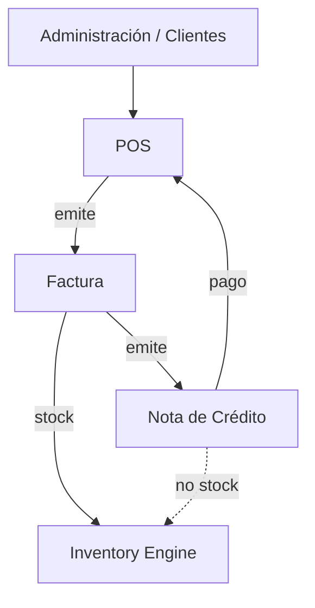

# Módulo — Ventas

## Objetivo

Cubrir el ciclo comercial: cobro en POS, facturas, postventa (cambios), notas de crédito derivadas de factura, y consulta administrativa de NC.

---

## Responsabilidades

| Hace | No hace |
|------|---------|
| Emitir ventas / facturas | Ser dueño del stock |
| Pagos (efectivo, tarjeta, transferencia, NC) | CRUD completo de clientes |
| Cambios postventa | Emitir NC sin factura |
| Emitir NC desde expediente | Campo Referencia en pagos |
| Listar NC (solo consulta) | Módulo Devoluciones independiente |

---

## Arquitectura

- Código: `backend/src/modules/ventas/`, `Frontend/src/modules/ventas/`  
- API: `/api/v1/ventas`  
- **Requiere** composition Inventario (Engine compartido).  
- Aggregate Root: `Venta` (= factura).  
- Cliente API FE: `ventasApi.ts`.

Docs: [`docs/sales/`](../../docs/sales/).

---

## Pantallas

| Ruta | Rol |
|------|-----|
| `/ventas` | Dashboard |
| `/ventas/pos` | Punto de venta |
| `/ventas/facturas` | Listado facturas |
| `/ventas/facturas/:id` | Expediente (tabs: general, productos, pagos, historial, cambios, NC, inventario) |
| `/ventas/notas-credito` | Listado administrativo NC |

---

## Base de datos relacionada

`ventas`, `venta_lineas`, `pagos` (+ `nota_credito_id`), `cambios`, `notas_credito`, `nota_credito_aplicaciones`, `historial_ventas`, `venta_clientes`.

---

## Servicios

`VentaApplicationService` + handlers (emitir, listar, NC, cambios, anular, etc.).  
Adapters: Engine, ACL clientes, permisos (`x-user-id`).

---

## Reglas

- Menú con NC solo consulta.  
- Emisión NC: Facturas → expediente → Emitir.  
- Pago NC: selector + `notaCreditoId`.  
- Sin Referencia en pagos.  
- Cambio = única vía de devolución física.

---

## Flujos

Ver carpeta [07_flujos/](../07_flujos/).

---

## Relaciones con otros módulos

