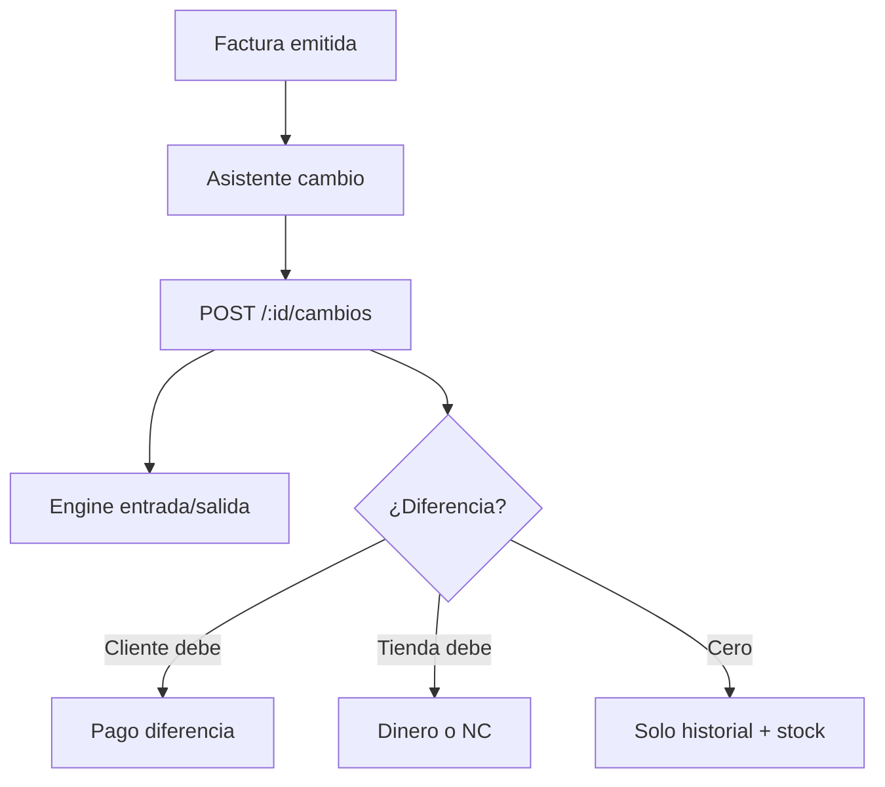

# Flujo — Cambio / postventa

## Objetivo

Registrar cambio de mercancía sobre una factura existente (incluye solo devolución física).

---

## Descripción

1. Expediente de factura → tab **Cambios**.  
2. Asistente: líneas a devolver / entregar (o solo devolver).  
3. `POST /api/v1/ventas/:id/cambios`.  
4. Engine ajusta stock; opcional pago de diferencia o compensación NC.

No hay menú “Devoluciones”.

---

## Diagrama

---

## Notas

Pagos de diferencia: forma + monto (sin Referencia).
