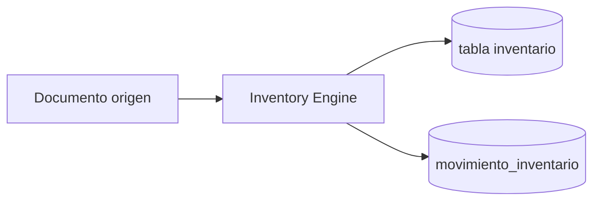

# Flujo — Movimientos de Inventario

## Objetivo

Explicar cómo el stock cambia en el sistema.

---

## Descripción

Cualquier cambio de existencia pasa por el **Inventory Engine** con:

- producto, almacén, cantidad, sentido  
- documento origen  
- usuario  
- idempotencyKey  

Orígenes típicos:

| Origen | Ejemplo |
|--------|---------|
| Inventario | Despachar/recibir TRF, aplicar ajuste/descarte, regularizar conteo |
| Ventas | Emitir venta (salida), anular, cambio (entrada/salida) |

---

## Diagrama

---

## Qué no genera movimiento

- Emitir / anular / aplicar Nota de Crédito  
- Reimprimir factura  
- Crear borradores de TRF/ajuste/descarte sin “aplicar/despachar”

---

## Notas

API inventario: `/api/inventario/...`  
Consulta desde factura: `GET /api/v1/ventas/:id/inventario`
