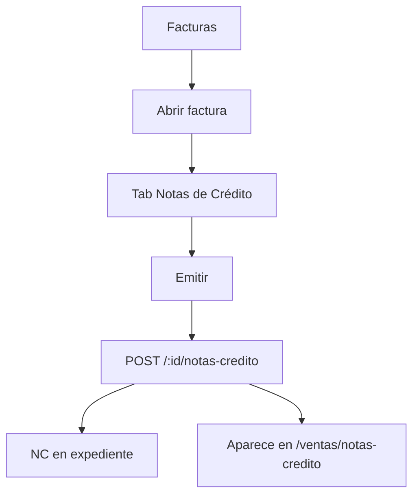
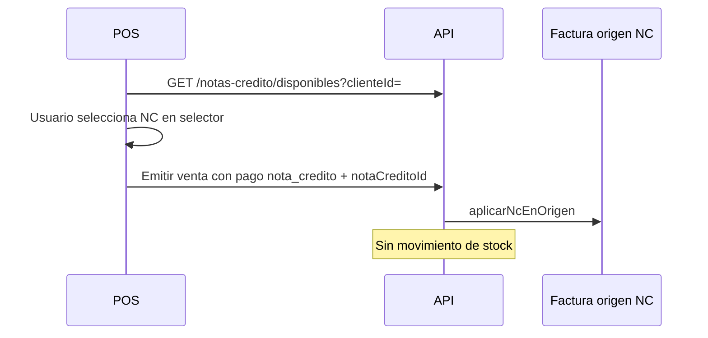

# Flujo — Nota de Crédito (emisión y aplicación)

## Objetivo

Emitir NC desde factura y aplicarla en una venta posterior.

---

## Emisión

**No** se emite desde el listado administrativo.

---

## Aplicación en POS

---

## Estados NC

emitida → parcialmente_aplicada → aplicada (o anulada sin aplicaciones).

---

## Notas

Anular: `POST /:id/notas-credito/:ncId/anular` solo si saldo completo sin aplicaciones.
