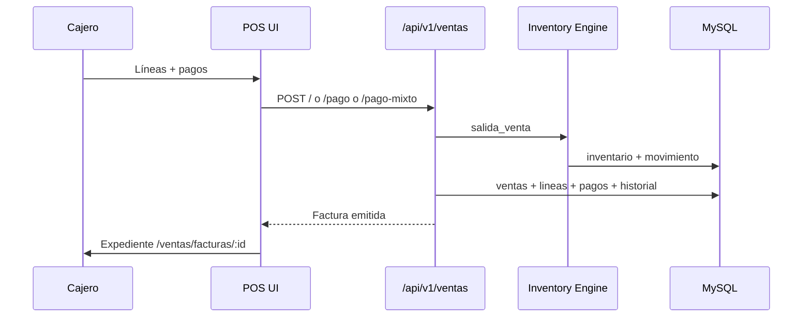

# Flujo — Venta completa (facturación)

## Objetivo

Emitir una factura cobrada desde el POS.

---

## Descripción

1. Usuario abre **Ventas → POS**.  
2. Agrega productos; opcionalmente selecciona cliente registrado.  
3. Define pagos (una o más formas).  
4. Emite → backend crea `Venta`, aplica salida de stock vía Engine, persiste pagos/historial.  
5. Redirige al expediente de la factura.

---

## Diagrama

---

## Endpoints

`POST /api/v1/ventas`, `/pago`, `/pago-mixto`

---

## Notas

Si hay pago `nota_credito`, tras guardar se aplica saldo en la NC origen (`notaCreditoId`).
