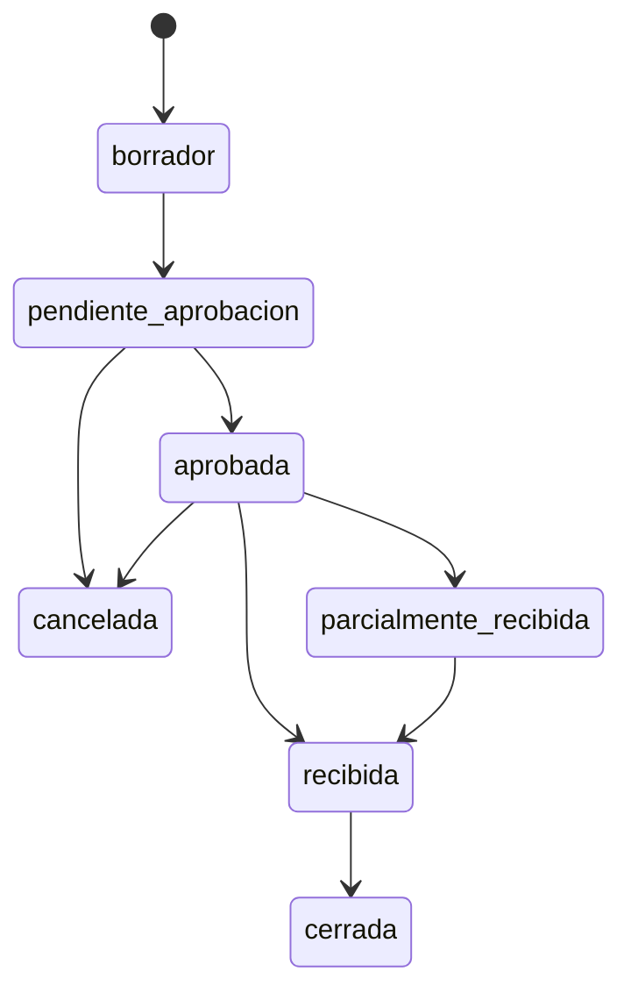

# Módulo Compras

Documentación técnica oficial.  
Frontend: `Modulos/Compras/Frontend/`.  
Backend runtime: Express clásico en `backend/` (ver `Modulos/Compras/Backend/README.md`).

---

## Objetivo del módulo

Gestionar el ciclo de **compra nacional**: órdenes de compra (OC), recepciones y facturas de proveedor, con numeración documental y puente controlado hacia Inventario e Importaciones.

---

## Responsabilidades

| Incluye | No incluye |
|---------|------------|
| OC (borrador → aprobación → recepción → cierre) | Ser dueño del stock |
| Recepciones y confirmación | POS / facturas de venta |
| Facturas proveedor **nacionales** (1:1 con OC) | Facturas internacionales (Importaciones) |
| Condiciones de pago de compra | CRUD proveedores/productos (Admin) |

---

## Arquitectura del módulo

```
Modulos/Compras/
├── Frontend/     # React (junction → Frontend/src/modules/compras)
├── Backend/      # README → código en backend/{controllers,services,...}/compras/
└── Database/     # schema.sql (= 06_Compras.sql)
```

```
Frontend ──HTTP──► /api/compras  y  /api/v1/compras
                         │
                         ▼
              backend Express (layers clásicas)
                         │
            ┌────────────┼────────────┐
            ▼            ▼            ▼
         SQL Server   InventoryPort  Importaciones
                      (stub default)  (OC internacional)
```

---

## Estructura de carpetas

### Frontend (`Modulos/Compras/Frontend`)

```
components/   PurchaseOrderRecordDialog, ReceptionRecordDialog, SupplierInvoiceRecordDialog
constants/    comprasUi.ts
hooks/        useComprasCatalogos.ts
layouts/      ComprasLayout.tsx
mocks/        mockCompras.ts
pages/        ComprasDashboard, OrdenesCompraPage, NuevaOrdenCompraPage,
              RecepcionesPage, FacturasProveedoresPage
services/     comprasApi, comprasLoader, comprasMappers, purchaseService
```

### Backend (runtime en `backend/`)

| Capa | Ruta |
|------|------|
| Routes | `backend/routes/compras/` |
| Controllers | `backend/controllers/compras/` |
| Services | `backend/services/compras/` |
| Repositories | `backend/repositories/compras/` |
| Validators | `backend/validators/compras/` |
| Models | `backend/models/compras/` |
| Auth / errors | `middlewares/comprasAuth.js`, `errors/PurchaseError.js` |

No mover aún a `Modulos/Compras/Backend/` (requires relativos al shell).

### Database

- Oficial: `database/sqlserver/06_Compras.sql`
- Copia: `Modulos/Compras/Database/schema.sql`

---

## Frontend

### Rutas UI (vía `ComprasLayout`)

| Ruta | Página |
|------|--------|
| `/compras` | Dashboard |
| `/compras/ordenes` | Listado OC |
| `/compras/ordenes/nuevo` | Alta OC |
| `/compras/recepciones` | Recepciones |
| `/compras/facturas` | Facturas proveedor |

Flag: `VITE_USE_API_COMPRAS=true`.

### Componentes principales

- `PurchaseOrderRecordDialog` — detalle/acciones OC
- `ReceptionRecordDialog` — recepción
- `SupplierInvoiceRecordDialog` — factura proveedor

### Hooks

- `useComprasCatalogos` — carga catálogos (proveedores, productos, almacenes, etc.)

### Contextos

- Ninguno propio. Usa providers del shell (Toast, ERP store si aplica).

### Servicios FE

| Servicio | Rol |
|----------|-----|
| `comprasApi` | Cliente HTTP del módulo |
| `comprasLoader` / `comprasMappers` | Carga y mapeo de DTOs |
| `purchaseService` | Transiciones / validaciones sobre estado ERP (mock/API híbrido) |

Usa `Compartido`: `validators`, `stateMachines` (etiquetas/transiciones de compra).

---

## Backend

Montaje en `server.js`:

- `/api/compras`
- `/api/v1/compras` (mismo router)

Auth: `authPlaceholder` + roles críticos **ADMIN|COMPRAS**; header `x-user-id`.

### APIs

| Recurso | Operaciones |
|---------|-------------|
| `/condiciones-pago` | CRUD/listado |
| `/ordenes` | CRUD + `enviar-aprobacion`, `aprobar`, `cancelar`, `cerrar` |
| `/recepciones` | CRUD + `confirmar`, `anular` |
| `/facturas` | CRUD + `por-orden/:ordenId`, `anular` |

Mutaciones multi-tabla dentro de transacción (`withTransaction`).  
Numeración: `TYPE-YYYY-######` con bloqueo de fila.

### Modelos

Documentos separados (no fusionar en una sola entidad):

- Orden de compra + detalle
- Recepción + detalle
- Factura proveedor + detalle
- Condición de pago
- Numeración de documentos

---

## Database

| Script | Contenido |
|--------|-----------|
| `06_Compras.sql` | Tablas OC, recepción, factura proveedor, numeración, etc. |
| Pack completo | `database/sqlserver/install.sql` |

Copias de navegación: `Modulos/Compras/Database/`.

---

## Flujo completo del módulo



1. Crear OC (nacional o internacional).
2. Enviar a aprobación → aprobar.
3. Registrar recepción(es); al **confirmar**, invocar puerto de Inventario (stub si no hay Engine cableado).
4. Si OC **nacional**: emitir Factura proveedor 1:1.
5. Si OC **internacional**: no emitir FP aquí → flujo Importaciones.
6. Cerrar OC cuando corresponda.

---

## Dependencias con otros módulos

| Módulo | Relación |
|--------|----------|
| **Inventario** | Puerto `_inventoryPort.js` al confirmar recepción |
| **Importaciones** | OC/recepción internacional |
| **Admin** | Proveedores, productos, monedas, almacenes |
| **Compartido** | `validators`, `stateMachines` |

---

## Reglas de negocio

1. Documentos separados: OC ≠ Recepción ≠ Factura proveedor.
2. FP solo nacional y **1:1** con OC.
3. Compras **no** es dueño del stock (X-01 / ADR-001).
4. Numeración atómica con bloqueo.
5. Roles para escrituras críticas.
6. Transacciones en operaciones multi-tabla.

---

## Cómo extender el módulo

1. Nuevo endpoint: route → controller → service → repository → validator en `backend/.../compras/`.
2. Nueva pantalla: página en `Frontend/pages` + ruta en layout/router.
3. Actualizar `comprasApi` / mappers.
4. SQL en `06_Compras.sql` + sincronizar copia `Database/`.
5. Actualizar **esta guía**.

---

## Buenas prácticas

- No escribir existencias desde Compras; solo puerto.
- No mezclar factura internacional en este módulo.
- Mantener `Modulos/Compras/Backend/README.md` apuntando al runtime real.
- Validar dominio en validators dedicados, no solo en el FE.

---

## Posibles mejoras futuras

- Migrar Express a `Modulos/Compras/Backend` con estrategia de paths/`NODE_PATH` sin romper requires.
- Cablear InventoryPort real (quitar stub en entornos productivos).
- OpenAPI formal del módulo Compras.
- Unificar flags y reducir dependencia de `purchaseService` mock.
