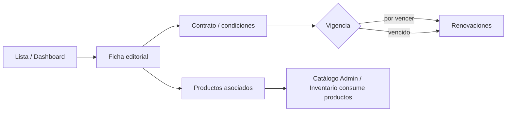

# Módulo Editoriales

Documentación técnica oficial.  
Frontend: `Modulos/Editoriales/Frontend/`.  
Backend runtime: Express en `backend/` (`*editoriales.*`).

---

## Objetivo del módulo

Administrar el **maestro de editoriales** (publishers): ficha, contratos/condiciones comerciales en UI, renovaciones, productos asociados y tablero de seguimiento de vigencia contractual.

---

## Responsabilidades

| Incluye | No incluye |
|---------|------------|
| Listado y ficha de editoriales | Stock / kardex |
| Dashboard de contratos y renovaciones | Órdenes de compra |
| Condiciones y productos asociados (vista) | POS / facturas de venta |
| API `/api/editoriales` | Ser dueño del catálogo de productos (Admin/Catálogo) |

---

## Arquitectura del módulo

```
Modulos/Editoriales/
├── Frontend/     # junction → Frontend/src/modules/editoriales
├── Backend/      # README → backend/controllers|services|repositories|routes editoriales
└── Database/     # schema.sql (= 12_Editoriales.sql; tabla base en 03_Administracion)
```

```
FE Editoriales ──► /api/editoriales ──► Express service/repository ──► SQL Server
                         │
                         └── productos asociados vía catálogo (editorialId)
```

---

## Estructura de carpetas

### Frontend

```
layouts/    EditorialesLayout.tsx
lib/        editorialesDisplay.ts, publisherContractStatus.ts
pages/      EditorialesDashboard, EditorialesLista, ContratosPage,
            RenovacionesPage, CondicionesPage, ProductosAsociadosPage
services/   editorialesApi.ts
```

Shims legacy en shell: `@/lib/editorialesDisplay`, `@/lib/publisherContractStatus` → reexportan este módulo.

### Backend (runtime)

| Pieza | Archivo |
|-------|---------|
| Routes | `backend/routes/editoriales.routes.js` |
| Controller | `backend/controllers/editoriales.controller.js` |
| Service | `backend/services/editoriales.service.js` |
| Repository | `backend/repositories/editoriales.repository.js` |

Mount: `app.use('/api/editoriales', …)` en `server.js`.

### Database

| Script | Rol |
|--------|-----|
| `03_Administracion.sql` | Tabla base de editoriales (pack compartido) |
| `12_Editoriales.sql` | Constraints, checks, SPs (`sp_Editorial_*`) |
| `Modulos/Editoriales/Database/schema.sql` | Copia de navegación de `12_Editoriales.sql` |

---

## Frontend

### Rutas UI

| Ruta | Página |
|------|--------|
| `/editoriales` | Dashboard |
| `/editoriales/lista` | Listado |
| `/editoriales/contratos` | Contratos |
| `/editoriales/renovaciones` | Renovaciones |
| `/editoriales/condiciones` | Condiciones |
| `/editoriales/productos` | Productos asociados |

Hay redirecciones legacy desde rutas de administración/inventario hacia el flujo de editoriales (ver `Frontend/src/routes/index.tsx`).

### Componentes principales

- No hay carpeta `components/` dedicada; la UI vive en `pages/` + layout.
- Helpers visuales en `lib/`.

### Hooks

- Ninguno exclusivo del módulo.

### Contextos

- Ninguno propio.
- Parte del CRUD administrativo de publishers puede convivir con pantallas Admin (`adminPath`); este módulo concentra la experiencia “Editoriales”.

### Servicios FE

- `editorialesApi` — cliente sobre `/api/editoriales`
- `editorialesDisplay` — formato de fechas/textos (UTF-8 / `dd/MM/yyyy`)
- `publisherContractStatus` — estado visual del contrato:
  - **vigente**
  - **por vencer** (≤ 30 días)
  - **vencido**

---

## Backend

### APIs

| Método | Ruta | Uso |
|--------|------|-----|
| GET | `/` | Listado |
| GET | `/search` | Búsqueda |
| GET | `/dashboard` | KPIs / resumen |
| GET | `/productos` | Productos asociados |
| GET | `/:id` | Detalle |
| POST | `/` | Alta |
| PUT | `/:id` | Actualización |
| PATCH | `/:id/estado` | Cambio de estado |

### Modelos

Entidad editorial (maestro) con datos de contacto, estado y campos de contrato/vigencia usados por la UI.  
Productos se asocian por `editorialId` en catálogo, no como stock del módulo.

---

## Database

Instalador oficial: `database/sqlserver/install.sql`.

Reglas típicas en `12_Editoriales.sql`:

- Nombre único
- Validación de email
- Procedimientos almacenados de mantenimiento/consulta

---

## Flujo completo del módulo



1. Consultar o crear editorial vía API.
2. Revisar contratos y condiciones en UI.
3. Seguir renovaciones según `publisherContractStatus`.
4. Ver productos ligados; el stock de esos productos lo maneja **Inventario**.

---

## Dependencias con otros módulos

| Módulo | Relación |
|--------|----------|
| **Admin** | Solapamiento histórico de rutas/CRUD publishers; helpers `adminPath` |
| **Catálogo / Inventario** | Productos con `editorialId`; Editoriales no mueve stock |
| **Compras** | Puede usar proveedores/productos, no esta API directamente |
| **Compartido** | Sin dependencias actuales |

---

## Reglas de negocio

1. Editorial es maestro de catálogo, no dueño de existencias.
2. Nombre único; email con formato válido (BD).
3. Ventana visual de vencimiento de contrato: **30 días**.
4. Productos asociados se resuelven desde catálogo.
5. Cambios de estado vía `PATCH /:id/estado`.

---

## Cómo extender el módulo

1. Nuevo campo: migración en pack SQL (`03`/`12`) + repository/service + página FE + `editorialesApi`.
2. Nueva vista (ej. historial de renovaciones): página en `Frontend/pages` + ruta en layout/router.
3. Si se añade backend DDD, documentar el cambio de ubicación en `Backend/README.md` y aquí.
4. Actualizar **esta guía**.

---

## Buenas prácticas

- Mantener formato de fechas centralizado en `editorialesDisplay`.
- No acoplar reglas de stock.
- Documentar cualquier redirect de rutas legacy.
- Preferir API real sobre mocks al cerrar features.

---

## Posibles mejoras futuras

- Migrar Express a `Modulos/Editoriales/Backend` cuando haya estrategia de resolución de módulos.
- Unificar por completo CRUD Admin vs módulo Editoriales (una sola UX).
- Tests de contrato de API y de `publisherContractStatus`.
- Internacionalización de etiquetas de estado.
