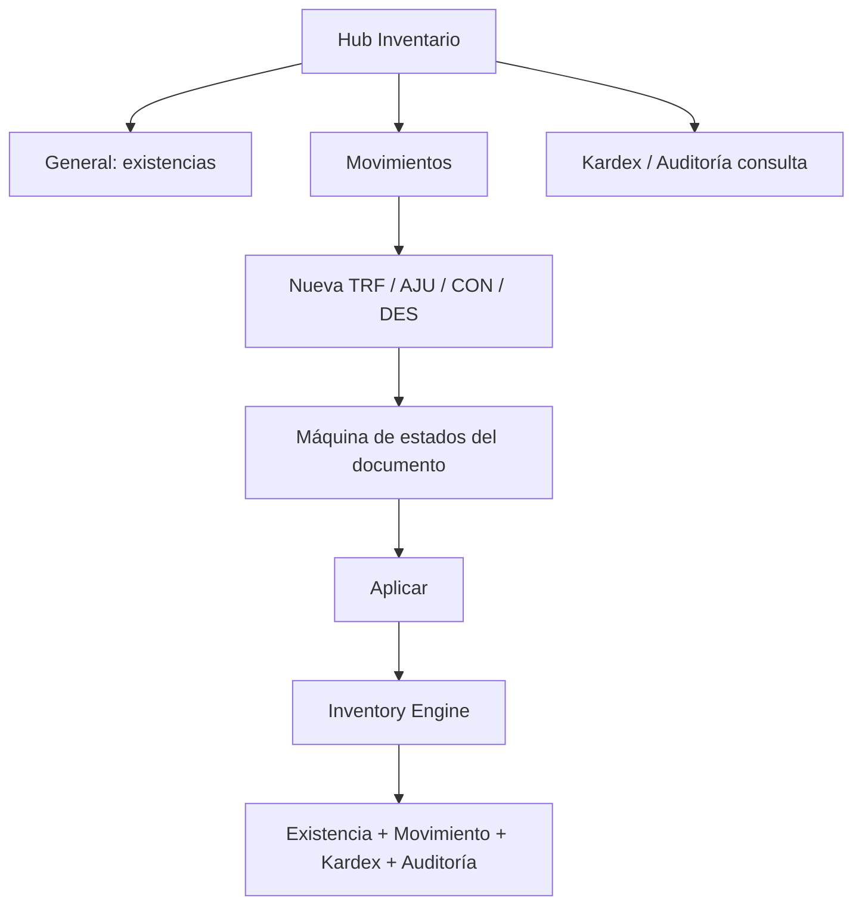

# Módulo Inventario

Documentación técnica oficial. Código: `Modulos/Inventario/`.  
Última alineación con reorganización modular y shell `Frontend/` + `backend/`.

---

## Objetivo del módulo

Ser el **único dueño del stock** de LibroSys: existencias por producto×almacén, movimientos, kardex, transferencias, ajustes, conteos físicos, descartes y auditoría de inventario.

---

## Responsabilidades

| Incluye | No incluye |
|---------|------------|
| Existencias y saldos | CRUD de productos/almacenes (Admin) |
| Motor de inventario (Engine) | Facturación / POS (Ventas) |
| Transferencias, ajustes, conteos, descartes | Órdenes de compra / recepciones (Compras) |
| Kardex y auditoría de movimientos | Contratos de editoriales |
| APIs de consulta (productos inventariables, dashboard KPIs) | Maestros de monedas / proveedores |

---

## Arquitectura del módulo

```
Modulos/Inventario/
├── Frontend/     # React (junction → Frontend/src/modules/inventario)
├── Backend/      # DDD TypeScript (junction → backend/src/modules/inventario)
└── Database/     # Copias de navegación (instalador = database/sqlserver/)
```

### Backend (DDD)

| Capa | Rol |
|------|-----|
| `domain/` | Agregados (Transferencia, Ajuste, Conteo, Descarte), entidades (Existencia, Movimiento, Kardex), VOs, eventos, errores |
| `application/` | Services, handlers, commands, ports outbound |
| `infrastructure/` | HTTP (`/api/inventario`), persistencia, adapters (clock, auth), composition, bootstrap |

**Regla de oro:** solo el **Inventory Engine** muta existencias. Ventas/Compras usan puertos; nunca escriben tablas de stock.

### Frontend

Hub en `/inventario` con tabs: **General · Movimientos · Kardex · Auditoría**. Los procesos (TRF, AJU, CON, DES) se abren como pantallas completas desde Movimientos / CTAs contextuales (`movimientosContext`).

### Montaje

En `backend/server.js`: `mountInventarioModule(app)` **antes** de Ventas. Base HTTP: `/api/inventario`.

---

## Estructura de carpetas

```
Modulos/Inventario/
  README.md
  Frontend/
    components/     InventoryDashboard, InventoryTabNav
    pages/          Inventory + procesos y detalles
    tabs/           General, Movimientos, Kardex, Auditoria
    services/       *Api.ts + inventoryService, transferService
    types/          inventoryUi.ts
    utils/          movimientosContext, statusBadges
    data/           mocks de dominio UI
    mocks/
  Backend/
    domain/
    application/
    infrastructure/
      api/http/     routes, controllers, validators
      bootstrap/    mountInventarioModule.ts
      composition/  createInventarioComposition.ts
    docs/           manuales técnicos internos del BE
  Database/
    schema.sql      ← 05_Inventario.sql
    views.sql       ← 08_Views.sql
    procedures.sql  ← 09_StoredProcedures.sql
    README.md
```

Junctions:

- `Frontend/src/modules/inventario` → `Modulos/Inventario/Frontend`
- `backend/src/modules/inventario` → `Modulos/Inventario/Backend`

---

## Frontend

### Pantallas principales

| Página | Rol |
|--------|-----|
| `Inventory.tsx` | Hub con tabs |
| `FichaProductoPage`, `NuevoProductoPage`, `NuevoCosteoPage` | Producto / costeo |
| `NuevaTransferenciaPage`, `RecepcionTransferenciaPage`, `DetalleTransferenciaPage` | Transferencias |
| `NuevoAjustePage`, `DetalleAjustePage` | Ajustes |
| Flujo conteo: `NuevoConteo` → `Captura` → `Revision` → `Clasificacion` → `Reconteo` → `Regularizacion` + `DetalleConteo` | Conteos físicos |
| `NuevoDescartePage`, `DetalleDescartePage` | Descartes |
| `DetalleMovimientoPage`, `DetalleKardexPage`, `DetalleAuditoriaPage` | Consultas |

### Componentes principales

- `InventoryDashboard` — KPIs del hub
- `InventoryTabNav` — navegación de tabs
- Layout de detalle: `Compartido/Components/DetailPageShell` (vía `@/compartido/...`)

### Hooks

- No hay hooks locales exclusivos.
- Usa `Compartido/hooks/useProductosMaestro` (catálogo productos) y hooks de shell (`useToast`, etc.).

### Contextos

- Ningún context propio del módulo.
- Toast / providers de app desde el shell.

### Servicios FE

| Servicio | Uso |
|----------|-----|
| `existenciasApi`, `movimientosApi`, `kardexApi`, `auditoriaInventarioApi` | Consultas |
| `transferenciasApi`, `ajustesApi`, `conteosApi`, `descartesApi` | Procesos |
| `inventarioQueryApi` | Productos / dashboard |
| `inventoryService`, `transferService` | Capa ERP store (mock/transiciones UI) |

Flags: `VITE_USE_API_INVENTARIO=true` para API real.

---

## Backend

- Namespace / mount: `/api/inventario`
- OpenAPI: `/api/inventario/openapi.json`
- Auth: header `x-user-id` (+ roles según ruta)

### APIs (resumen)

| Área | Endpoints típicos |
|------|-------------------|
| Transferencias | `POST/GET /transferencias`, `…/solicitar\|cancelar\|despachar\|recibir` |
| Ajustes | `POST/GET /ajustes`, ciclo solicitar→aprobar→aplicar / rechazar / cancelar / revertir |
| Conteos | `POST/GET /conteos`, abrir/revisión/cerrar/reconteo/cancelar, líneas, clasificar |
| Descartes | `POST/GET /descartes`, solicitar→aprobar→aplicar… + evidencias |
| Consultas | `/productos`, `/existencias`, `/movimientos`, `/kardex`, `/auditoria`, `/dashboard` |
| Ops | `POST /outbox/process` |

Envelope de errores alineado al resto del ERP (validación, dominio, permisos).

### Modelos (dominio)

- Agregados: `Transferencia`, `Ajuste`, `ConteoFisico`, `Descarte`
- Entidades: `Existencia`, `MovimientoInventario`, `Kardex`, `AuditoriaMovimiento`
- VOs: `Cantidad`, `Saldo`, `TipoMovimiento`, `DocumentoOrigenRef`, `IdempotencyKey`

---

## Database

| Pieza | Ubicación oficial | Copia navegación |
|-------|-------------------|------------------|
| Schema inventario | `database/sqlserver/05_Inventario.sql` | `Modulos/Inventario/Database/schema.sql` |
| Vistas | `08_Views.sql` | `views.sql` |
| Procedimientos | `09_StoredProcedures.sql` | `procedures.sql` |

**Instalar siempre** con `database/sqlserver/install.sql` (orden 01–12). No usar las copias de `Modulos/` como instalador.

Maestros relacionados: `03_Administracion` (almacenes), `04_Catalogo` (productos).

---

## Flujo completo del módulo



1. Usuario elige proceso desde Movimientos (CTA contextual).
2. Documento avanza por estados (solicitar / aprobar / despachar / recibir / aplicar…).
3. Al **aplicar**, el Engine actualiza stock de forma atómica e idempotente.
4. Consultas leen vistas/API sin mutar.

Flujos narrativos adicionales: [guia/07_flujos/movimientos_inventario.md](../../07_flujos/movimientos_inventario.md).

---

## Dependencias con otros módulos

| Módulo | Relación |
|--------|----------|
| **Ventas** | Consume Engine vía composition compartida al montar |
| **Compras** | Recepción puede invocar puerto de inventario (stub por defecto) |
| **Admin** | Productos y almacenes maestros |
| **Compartido** | `DetailPageShell`, `useProductosMaestro`, `validators`, `stateMachines` (transferencias) |

---

## Reglas de negocio

1. Inventario es el **único** escritor de existencias (ADR-001).
2. Stock por producto×almacén; cantidades enteras no negativas; control de versión optimista.
3. Idempotency keys en operaciones críticas.
4. Almacén puede bloquearse durante conteo físico.
5. Documentos con máquina de estados; mutación de stock solo en transición **aplicar** (o equivalente Engine).
6. Consumidores externos solo vía puertos/adapters.

Ver también [03_reglas_de_negocio.md](../../03_reglas_de_negocio.md).

---

## Cómo extender el módulo

1. **Nuevo tipo de movimiento / documento:** modelar en `domain/`, servicio en `application/`, rutas en `infrastructure/api/http`, página FE en `Frontend/pages`, entrada en `movimientosContext` si aplica.
2. **Nueva consulta:** endpoint en routes + cliente `*Api.ts` + tab/página.
3. **SQL:** editar pack oficial `database/sqlserver/` y sincronizar copia en `Database/`.
4. Actualizar **esta guía** en el mismo cambio ([CONVENCIONES](../../CONVENCIONES.md)).

---

## Buenas prácticas

- No poner lógica de negocio en controllers ni en componentes React.
- No duplicar Engine en Ventas/Compras.
- Preferir pantallas completas (`DetailPageShell` / `FormPageLayout`) frente a mega-diálogos para procesos largos.
- Mantener shims `@/pages/inventario/*` hasta que no tengan consumidores.
- Tests de dominio/handlers en `Backend/` ante cambios de invariantes.

---

## Posibles mejoras futuras

- Migrar persistencia in-memory/durable file a SQL Server de punta a punta en todos los flujos.
- Unificar flags FE y eliminar dualidad mock/API donde ya no haga falta.
- Documentar OpenAPI generado en la UI de desarrollo.
- Extraer más UI compartida de detalle a `Compartido/` si otros módulos la reutilizan.
- Cobertura e2e de conteo completo (captura → regularización).
