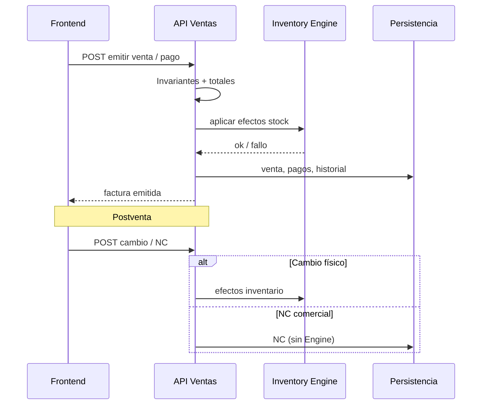

# Módulo Ventas

Documentación técnica oficial. Código: `Modulos/Ventas/`.  
Backend DDD montado en `/api/v1/ventas` con Engine de Inventario compartido.

---

## Objetivo del módulo

Cubrir el ciclo comercial: **POS**, emisión de venta/factura, consulta de facturas, postventa (cambios), notas de crédito y historial — sin ser dueño del stock.

---

## Responsabilidades

| Incluye | No incluye |
|---------|------------|
| Emitir venta (= factura) | Mutar existencias directo |
| Pagos (simple / mixto / NC como medio) | CRUD de clientes (Admin) |
| Cambios físicos de producto | Módulo independiente de “Devoluciones” |
| NC desde factura (consulta/emisión/anulación comercial) | Maestros de productos (Admin) |
| Historial y reimpresión | Compras / editoriales |

---

## Arquitectura del módulo

```
Modulos/Ventas/
├── Frontend/     # junction → Frontend/src/modules/ventas
├── Backend/      # DDD TS → backend/src/modules/ventas
└── Database/     # schema.sql (= 07_Ventas.sql)
```

```
FE Ventas ──► /api/v1/ventas ──► application/domain
                    │
                    ├──► InventarioEfectosPort / Engine (stock)
                    └──► persistencia ventas (in-memory / SQL)
```

**Orden de montaje:** Inventario primero; `mountVentasModule(app, inventarioComposition)`.

---

## Estructura de carpetas

### Frontend

```
components/   CambioAsistente, FacturaTabNav, VentasCommercialDashboard,
              VentasApiRequiredBanner
context/      SalesDataContext.tsx
data/         posCatalog.ts
layouts/      VentasLayout.tsx
mocks/        mockVentas.ts
pages/        VentasDashboard, POSPage, VentasListPage, VentaDetallePage,
              NotasCreditoListPage, CambiosNotasCreditoPage, HistorialVentasPage
services/     ventasApi.ts
types/        facturaUi.ts, salesExchange.ts
utils/        ventasUi.ts
```

### Backend

```
domain/           aggregates (Venta), entities, VOs, policies, guards, events
application/      VentaApplicationService, handlers, commands, DTOs
infrastructure/
  api/http/       routes, controllers, validators, OpenAPI
  adapters/       Engine inventario, permisos, clientes, productos
  persistence/    InMemory / MySQL
  composition/    createVentasComposition, seed
  bootstrap/      mountVentasModule.ts
```

---

## Frontend

### Menú / rutas

| Entrada | Rol |
|---------|-----|
| Dashboard | KPIs comerciales |
| POS | Emisión de venta |
| Facturas | Listado + detalle (expediente) |
| Notas de crédito | **Consulta** (emisión desde detalle de factura) |

Flag: `VITE_USE_API_VENTAS=true`.

### Componentes principales

- `CambioAsistente` — asistente de cambio de producto
- `FacturaTabNav` — tabs del expediente de factura
- `VentasCommercialDashboard` — resumen
- `VentasApiRequiredBanner` — aviso si API no disponible
- Detalle: `Compartido/Components/DetailPageShell`

### Hooks

- Sin hooks locales; POS/cambio usan `useProductosMaestro` (Compartido).

### Contextos

- `SalesDataContext` — historial de ventas/cambios/NC en capa UI (seed + operaciones locales cuando aplica). Provider montado desde `App.tsx` (shim `@/context/SalesDataContext`).

### Servicios FE

- `ventasApi` — cliente HTTP hacia `/api/v1/ventas`
- `data/posCatalog` — catálogo POS / tipos
- `utils/ventasUi` — formato dinero, etiquetas, helpers UI

---

## Backend

- Base: `/api/v1/ventas`
- Docs: `/api/v1/ventas/docs`, OpenAPI `/openapi.json`
- Auth: `x-user-id` → roles cajero / supervisor / administrador

### APIs

| Método | Ruta | Uso |
|--------|------|-----|
| POST | `/`, `/pago`, `/pago-mixto` | Emitir venta |
| GET | `/`, `/:id`, `/por-numero/:numero` | Consulta |
| GET | `/clientes/buscar` | Búsqueda clientes |
| GET | `/:id/historial`, `/:id/inventario` | Expediente |
| POST | `/:id/reimprimir` | Reimpresión |
| POST | `/:id/cambios` | Cambio / devolución física |
| POST | `/:id/notas-credito` | Emitir NC |
| POST | `.../notas-credito/:ncId/anular` | Anular NC |
| POST | `/:id/anular`, `/cancelar` | Anulación venta |
| GET | `/notas-credito`, `/notas-credito/disponibles` | Consulta NC |

Envelope: `{ success, data }` / `{ success: false, error: { code, message } }`.  
Códigos relevantes: `422 DOMAIN_RULE`, `502 INVENTORY_FAILURE`.

### Modelos (dominio)

- Agregado: `Venta` (emisión = factura)
- Entidades: `VentaLinea`, `Pago`, `Cambio`, `NotaCredito`, `Devolucion`, `HistorialVenta`
- VOs: `Dinero`, `CantidadVenta`, `Descuento`, `NumeroFactura`, `IntencionEfectoInventario`
- Políticas / guards: `PoliticasVenta`, `InvariantesVenta`, `MaquinaEstadosVenta`

---

## Database

| Oficial | Copia |
|---------|-------|
| `database/sqlserver/07_Ventas.sql` | `Modulos/Ventas/Database/schema.sql` |

Tablas típicas: ventas, líneas, pagos, cambios, notas_credito, aplicaciones, historial, clientes de venta.

Instalador: `database/sqlserver/install.sql`.

---

## Flujo completo del módulo



Flujos: [venta_completa](../../07_flujos/venta_completa.md) · [nota_credito](../../07_flujos/nota_credito.md) · [cambio_postventa](../../07_flujos/cambio_postventa.md).

---

## Dependencias con otros módulos

| Módulo | Relación |
|--------|----------|
| **Inventario** | Obligatoria — Engine vía adapters |
| **Admin** | Clientes y productos (consulta) |
| **Compartido** | `DetailPageShell`, `useProductosMaestro` |

ADRs relacionados: 002 (clientes en Admin), 003 (NC desde factura), 004 (menú), 005 (sin módulo devoluciones), 006 (sin referencia en pagos).

---

## Reglas de negocio

1. Venta emitida **es** la factura (mismo agregado).
2. NC siempre desde factura; emisión/anulación de NC **no** mueve stock.
3. Único camino de retorno físico: **cambio** (no módulo Devoluciones).
4. Pagos: efectivo / tarjeta / transferencia / nota_credito; NC vía `notaCreditoId` (sin campo Referencia genérico).
5. Invariantes: ≥1 línea, qty>0, pagos cubren total, cliente registrado ⇒ `clienteId`, NC ≤ saldo acreditable.
6. Nunca escribir tablas de inventario desde Ventas.

---

## Cómo extender el módulo

1. Caso de uso nuevo: command/handler en `application/`, reglas en `domain/`, ruta en `ventasRoutes.ts`, pantalla o acción en FE.
2. Efecto de stock: pasar por puerto de Inventario, no SQL directo.
3. Actualizar OpenAPI y **esta guía**.

---

## Buenas prácticas

- Controllers delgados; dominio sin Express.
- UI sin reglas de totales/stock: delegar en API.
- Mantener menú alineado a ADRs (NC como consulta; postventa desde expediente).
- Probar fallos de inventario (`502`) y reglas (`422`).

---

## Posibles mejoras futuras

- Persistencia SQL Server unificada (hoy hay caminos in-memory/MySQL en infra).
- Reducir `SalesDataContext` mock cuando toda postventa viva 100% en API.
- Code-splitting del bundle FE de Ventas.
- Documentar matriz de permisos por rol en tabla dedicada.
